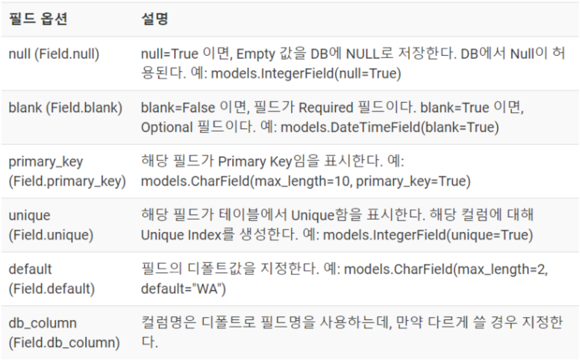
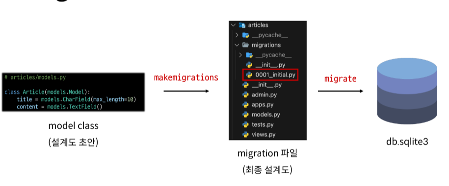
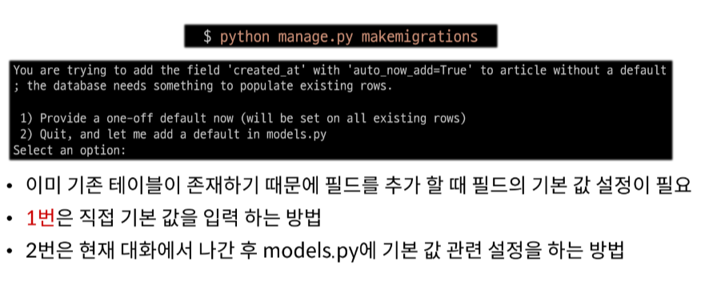
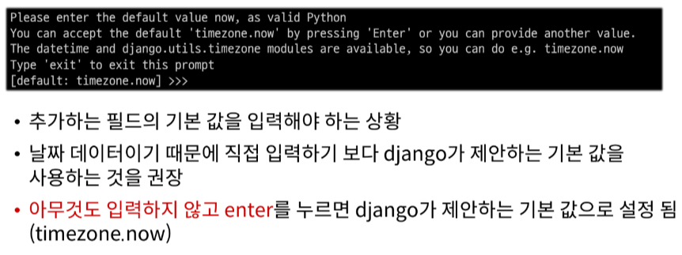
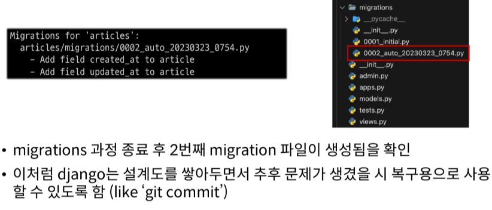
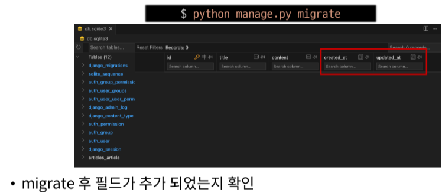
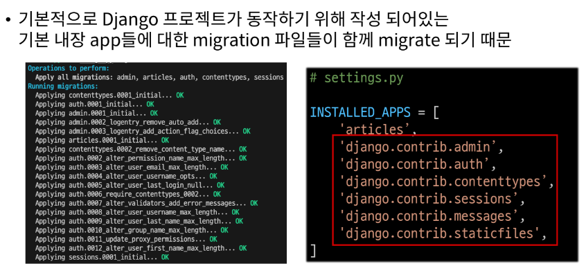

# 1. Model

## django Model
- DB의 테이블을 정의하고 데이터를 조작할 수 있는 기능들을 제공
- `테이블 구조를 설계`하는 청사진

## model 클래스 작성
- 테이블을 만들기 위한 설계도
- '모델 클래스 == 테이블 스키마'
- 클래스 이름 = 테이블 이름

```python
# articles/models.py

class Article(models.Model): # class의 가장 강력한 특징은 상속이다.
  title = models.CharField(max_length=10) # models라는 모듈안에 Model이라는 클래스가 있다. (class여서 맨 앞 대문자)
  content = models.TextField()

>> id 필드는 자동 생성
>> title, content -> 클래스 변수명 (테이블의 각 "필드 이름")
>> CharField, TextField -> model Field 클래스 (테이블 필드의 "데이터 타입")
>> (max_length=10) -> model Field 클래스의 키워드 인자 (필드 옵션) (테이블 필드의 "제약조건" 관련 설정)
```
- django.db.models 모듈의 Model이라는 부모 클래스를 상속 받아 작성
- 개발자는 테이블 구조를 어떻게 설계할 지에 대한 코드만 작성하도록 하기 위함

## Model 필드 타입

### 1. CharField()
- 제한 문자열 삽입
- `반드시` 최대 길이를 max_length 옵션에 지정

### 2. TextField()
- 텍스트 필드는 문자열과 비슷하게 보이지만, 대용량 문자열을 처리하는 필드이다.
- 캐릭터 필드보다는 DB용량을 많이 잡아 먹겠지만, 크기 제한을 굳이 할 필요가 없다.

### 3. IntegerField
- 32비트의 정수형 필드
- 사용 방법은 완전히 똑같지만 정수 사이즈에 따라 BigIntegerField, SmallIntegerField 사용 가능
- default는 맨 처음 수정없이 저장될 경우의 값
```python
count = models.IntegerField(default = 0, **options)
```

### 4. BooleanField
- True 또는 False만 저장하는 필드이다.
- Null을 허용하기 위해서는 NullBooleanField를 사용한다.
- initial는 맨 처음 수정없이 저장될 경우의 값을 뜻한다.
```python
bool = models.BooleanField(initial=True, **options)
```

### 5. DatetimeField
- 시간과 관련된 값을 저장하는 필드
- DateField : 날짜만 저장하고 싶을 경우에 사용
- TimeField : 시간만 가질 경우 사용

## DateTimeField의 선택인자
- auto_now : 데이터가 저장될 때마다 자동으로 현재 날짜 시간을 저장
  - 주로 updated_at
- auto_now_add : 데이터가 처음 생성될 때만 자동으로 현재 날짜시간을 저장
  - 주로 created_at

## :star: 필드 옵션
- 각 모델마다 따로 필요한 옵션도 있지만, 공통적으로 가지고 있고 주로 쓰는 옵션이 있다.
- 보통 필수 항목을 제외하면 blank 옵션이나 null을 활성화 시켜놓는다. 또 해당 필드가 DB내에서 중요한 Key 역할을 하게 될 경우, 관련 옵션을 사용하면 유용할 것이다.


# 2. Migrations

- model 클래스의 변경사항(필드 생성, 추가 수정 등)을 DB에 최종 반영하는 방법

## Migrations 과정


## Migrations 핵심 명령어

- model class를 기반으로 설계도(migration) 작성
```python
python manage.py makemigrations
```
- 만들어진 설계도를 DB에 전달하여 반영
```python
python manage.py migrate
```
- migrate 후 DB 내에 생성된 테이블을 확인할 수 있다.

## 이미 생성된 테이블에 필드를 추가해야 한다면:question:





## :star: model class에 변경사항이 생겼다면, 반드시 설계도를 생성하고, 이를 DB에 반영해야한다.

### 1. model class 작성 및 수정 -> 2. makemigrations -> 3. migrate
1. 클래스 만들고 models.py 클래스를 통해서 -> makemigration-> 2. 설계도 0001.initial.py만들고 이 설계도를 최종적으로 ->migrate 3. 데이터 베이스에 적용시킨 것
  -	이과정을 통틀어 migration과정이라고 부른다.
  -	반드시 이 절차를 밟아야한다.

# 3. Admin site

## Automatic admin interface
- django는 추가 설치 및 설정 없이 자동으로 관리자 인터페이스를 제공
- `데이터 관련 테스트 및 확인을 하기에 매우 유용`

## admin 계정 생성
```python
$ python manage.py createsuperuser
```
- email은 `선택사항`이기 때문에 입력하지 않고 진행 가능
- 비밀번호 생성 시 보안상 `터미널에 출력되지 않으니` 무시하고 입력을 이어가도록 한다.
- DB에 생성된 admin 계정 확인은 `auth_user`에서 확인할 수 있다.

## admin에 모델 클래스 등록
- admin.py에 등록하지 않으면 admin site에서 확인할 수 없다.
```python
# articles/admin.py

from django.contrib import admin
# 명시적 상대경로
from .models import Article -> models.py에서 정의한 Article클래스

# Register your models here.
# 암기 꿀팁 : admin site에 등록(register) 하겠다.
admin.site.register(Article) -> Aritcle 클래스를 admin에 등록
```

# 참고

## 데이터베이스 초기화
1. migration 파일 삭제
2. db.sqlite3 파일 삭제
- `migrations 폴더를 지우지 않도록 주의`

## Migrations 기타 명령어
```python
$ python manage.py showmigrations
```
- migrations 파일들이 migrate 됐는지 안됐는지 여부를 확인하는 용도이다.
- [X] 표시가 있으면 migrate가 `완료`되었음을 의미힌다.

```python
$ python manage.py sqlmigrate articles 0001
```
- 해당 migrations 파일이 SQL문으로 어떻게 해석되어 DB에 전달되는지 확인한는 용도

## 첫 migrate 시 출력 내용이 많은 이유는?
