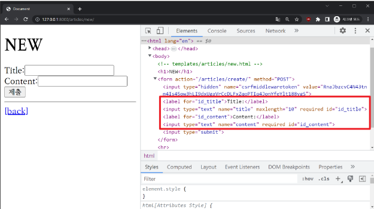
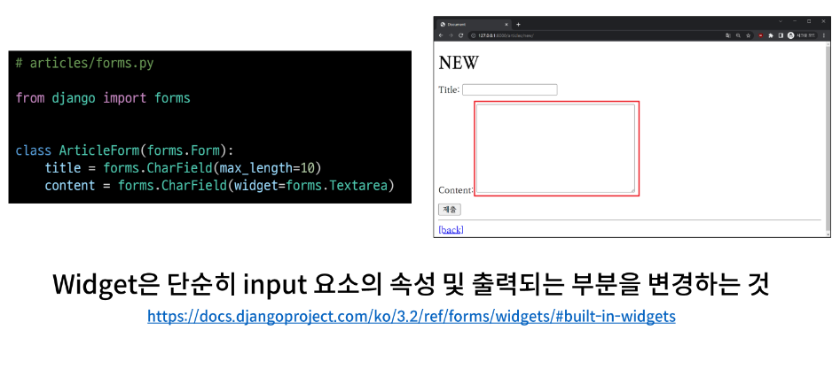
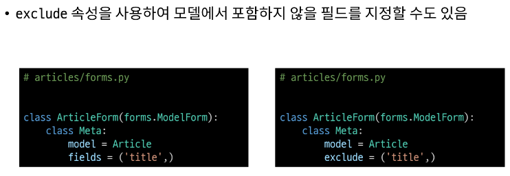

# 1. 개요

## HTML form
- 사용자로부터 form 요소를 통해 데이터를 받고 있으나 비정상적 혹은 악의적인 요청을 확인하지 않고 모두 수용중
- `우리가 원하는 데이터 형식이 맞는지에 대한 '유효성 검증' 필요`

## 유효성 검사
- 수집한 데이터가 정확하고 유효한 지 확인하는 과정
- 유효성 검증에는 입력 값, 형식, 중복, 범위, 보안 등 부가적인 많은 것들을 고려해야 한다.
- 이런 과정과 기능을 제공해주는 `도구`가 필요

# 2. Django Form
- 사용자 입력 데이터를 수집하고, 처리 및 유효성 검증을 수행하기 위한 도구
- `유효성 검사를 단순화하고 자동화 할 수 있는 기능을 제공`

## Form class 선언
- app에 forms.py을 생성
```python
# articles/forms.py
from django import forms

class ArticleForm(forms.Form):
  title = forms.CharField(max_length=10)
  content = forms.CharField()
```
## :arrow_down: form클래스로 form안에 있는아래 코드 input받는 것들을 만든다.
```python
# articles/new.html
<form action="" method="POST">
  

#########################################################
# 이 부분이 바뀐다.
  <div>
    <label for="title">제목: </label>
    <input type="text" name="title" id="title">
  </div>
  # 1번 div 묶음이 title
  <div>
    <label for="content">내용: </label>
    <textarea name="content" id="content" cols="30" rows="10"></textarea>
  </div>
  # 2번 div 묶음이 content
#########################################################

  <input type="submit">
</form>
```
## :arrow_down: form으로 작성할 시
```python
# articles/new.html
<form action="" method="POST">
  
#########################################################
# 바뀐 부분
  {{ form.as_p }}
#########################################################
  <input type="submit">
</form>
```
- form.as_p에서 .as_p는 Form rendering options

## models을 사용할 때, 저장 시 아래처럼 인스턴스를 생성하면서 저장한다.
```python
article = Article(title=title, content=content)
article.save()
```
## 마찬가지로 form도 ArticleForm이라는 클래스로 인스턴스를 생성하고 그것을 context에 넘겨준다.
```python
# articles/views.py
from django.shortcuts import render, redirect
from .models import Article
from .forms import ArticleForm

def new(request):
  form = ArticleForm() # ArticleForm을 통해 form이라는 인스턴스를 생성한다.
  # 이것을 context에 넘겨준다.
  context = {
      'form':form,
  }
  return render(request, 'articles/new.html', context)
```

## Form class 적용 결과

- label을 자동으로 만들어준다.
- 알아서 input의 name값을 title로 title변수이름을 따라서 정해줬다.
- html로 maxlength의 속성값을 줬다.
- required : 미입력시 작성 알림을 띄운다.

### 우리가 django Form을 사용하는 이유는 유효성 검사를 위해서 인데 아직은 적용이 안됐다(지금은 form을 통해 데이터를 받기만 한 것). 그래서 create 부분에 Form을 통해서 데이터를 처리한다.

# 3. Widgets
- HTML 'input' element의 표현을 담당


- input의 타입을 바꾸고 input의 속성 자체를 바꾼다.  
  ex.
  ```python
  # text입력창에서 체크박스로 바뀐다.
  content = forms.CharField(widget=forms.CheckboxInput)
  ```

# 4. Django ModelForm

## Form
- 사용자 입력 데이터를 DB에 `저장하지 않을 때`
  -(ex. 로그인)

## ModelForm
- 사용자 입력 데이터를 DB에 `저장해야 할 때`
  - (ex. 회원가입)

## :star:둘 다 사용자 입력 데이터를 받지만 `이 데이터가 DB에 저장이 되는가?`가 중점이다.

## ModelForm class 선언
- Form에서는 필드를 작성했지만, ModelForm에서는 필드를 작성하지 않는다.
```python
# articles/forms.py

form django import forms
form .models import Article # models.py에서 작성한 class Article을 가져온다.

class ArticleForm(forms.ModelForm):
  # ModelForm의 정보를 작성하는 곳
  class Meta:
    model = Article
    fields = '__all__'
    # exclude = ('title',)
    # created_at은 옵션값때문에 알아서 안나옴
    # auto_now같은 알아서 저장하는 기능때문에
```

## ModelForm class 출력 결과


- widget도 없고 필드도 작성하지 않고 모델만 알려줬는 데 결과가 같다.
  - models.py에서 작성한 class Article을 기반으로 만들었다.
  ```python
  from django.db import models

  # Create your models here.
  class Article(models.Model):
    title = models.CharField(max_length=10)
    content = models.TextField()
    created_at = models.DateTimeField(auto_now_add=True)
    updated_at = models.DateTimeField(auto_now=True)
  ```
  - ex. title은 charfield니까 textinput으로 만들자!
  - ex. created_at와 updated_at는 사용자로부터 입력받는 것이 아니네라면서 알아서 제외시켜준다.
  - 이렇게 model = Aritcle로 등록받아서 최종적으로 form을 만들 때 해석을 한다.
  - ModelForm은 사용자의 입력 데이터를 model에 저장할 때 DB에 저장할 때 사용하기 때문에!!
  - 아무리 필드가 많아져도 일반 form처럼 다시 하나씩 작성할 필요가 없이 등록만 잘해주면 (model = Article) 알아서 받아와서 만든다.

## Meta class
- ModelForm의 정보를 작성하는 곳
- 메타 데이터 : 데이터에 대한 데이터
- 컴퓨터에게 사진은 데이터
- 사진한테 데이터는 화소/언제찍었는지/어떤기종/조리개값 이런 값들을 사진의 메타 데이터라고 한다.
- 추가 정보 같은 느낌이다.

## fields 및 exclude 속성


## ModelForm을 적용한 create 로직
- 원래는 받는 정보를 아래 코드처럼 작성했다.
```python
def create(request):
  # new에서 보낸 사용자 데이터를 받아서 변수에 할당
  title = request.POST.get('title')
  content = request.POST.get('content')
```
```python
# articles/views.py

from .forms import ArticleForm

def create(request):
  # request.POST를 한번에 다 받아서 이걸 통한 결과물을 form에 저장
  form = ArticleForm(request.POST)
  # 유효성검사 / 이 메서드의 데이터 타입은 bool가 메서드가 is로 시작해서 return이 true아니면 False이다.
  # 유효성검사를 통과를 못하면 form에 실패 정보를 담아서 반환해준다.
  if form.is_valid():
    # form.save() # Ture라면 저장해라 / save된 결과가 새 게시물이다.
    # 이걸 저장해서 리턴값을 변수에 넣어주지 않으면 article.pk를 사용할 수가 없다. 그래서
    article = form.save()
    return redirect('articles:detail', article.pk)
  # 유효성검사를 통과 못했을 시 new페이지를 다시 보여준다.
  # redirect를 안하고 render를 하는 이유는 context를 사용하기 위해서이다.
  context = {
      'form':form,
  }
  return render(request, 'articles/new.html', context)
```
- article = `form`.save()과 context = { 'form':`form`, } 둘의 form은 다르다
- 1번 form은 유효성 검사를 통과한 form
- 2번은 form은 유효성 검사를 통과하지 못한 form이다.
- 그래서 서로 가지고 있는 데이터가 다르다.
- .is_valid()는 독특한 특징이 있다. 유효성 검사를 통과하지 못했을 때 2번 form에 에러메세지를 담아서 내려준다. if `form`.is_valid(): 이 form에

## ModelForm 적용 결과


## is_valid()
- 여러 유효성 검사를 실행하고, 데이터가 유효한지 여부를 boolean으로 반환한다.

## ModelForm을 적용한 edit 로직
- views.py

```python
# articles/views.py

def edit(request, article_pk):
  # 수정 페이지(Edit) 입력 요소에 미리 값을 채우기 위한 데이터 조회
  article = Article.objects.get(pk=article_pk)

  context = {
      'article': article
  }

  return render(request, 'articles/edit.html', context)
```
## :arrow_down:
```python
# articles/views.py

def edit(request, pk):
  article = Article.objects.get(pk=pk)
  form = ArticleForm(instance=article)
  context = {
    'article':article,
    'form':form,
  }
  return render(request, 'articles/edit.html', context)
```
- edit.html
```html
<form action="" method="POST">
  
----------------------------------------------------------------------------------------------
  <div>
    <label for="title">제목: </label>
    <input type="text" name="title" id="title" value="{{ article.title }}">
  </div>
  <div>
    <label for="content">내용: </label>
    <textarea name="content" id="content" cols="30" rows="10">{{ article.content }}</textarea>
  </div>
----------------------------------------------------------------------------------------------
  <input type="submit" value="[UPDATE]">
</form>
```
## :arrow_down:
```html
<form action="" method="POST">
  
----------------------------------------------------------------------------------------------
  {{ form.as_p}}
----------------------------------------------------------------------------------------------
  <input type="submit" value="[UPDATE]">
</form>
```
- 기존 데이터를 가져오는 것은 views.py에서   form = ArticleForm(instance=article)의 `instance=article`가 한다.
- 결국 is_valid나 instance, save 이런 것들은 class ArticleForm(forms.ModelForm)의 `ModelForm`에 있다.

## ModelForm을 적용한 update 로직
```python
def update(request, article_pk):
  # 수정 작업 과정
  # 1. 데이터 조회 -> delete
  article = Article.objects.get(pk=article_pk)

  # 2. 데이터 수정
  # 2-1. 사용자가 입력한 form 데이터 할당 -> create
  title = request.POST.get('title')
  content = request.POST.get('content')

  # 2-2. 조회한 데이터(article)의 필드 값 변경
  article.title = title
  article.content = content

  # 3. 데이터 저장 -> create
  article.save()

  return redirect('articles:detail', article.pk)
```
## :arrow_down:
```python
def update(request, article_pk):
  article = Article.objects.get(pk=article_pk)
  if request.method=='POST':
      form = ArticleForm(request.POST, instance=article)
      if form.is_valid():
          form.save()
          return redirect('articles:detail',article.pk)

  else:
      # 기존 데이터를 인자에 넣어줘야한다.key를 instance로 써야한다. (기존인자 article)
      form = ArticleForm(instance=article)
  context = {
      'article': article, # edit쪽에서 form의 pk의 urls로 쓰이고있다.
      'form':form,
  }

  return render(request, 'articles/edit.html', context)
```

## save()
- 데이터베이스 객체를 만들고 저장
- `키워드 인자 instance 여부를 통해 생성할 지 , 수정할 지를 결정`
```python
# CREATE
form = ArticleForm(request.POST)
form.save()

# UPDATE
form = ArticleForm(request.POST, instance=article)
form.save()
```


# Widget 응용
- widget을 사용할 때는 form의 필드 안(ex. Charfield)에서 사용해야해서 title = forms.Charfield부터 작성해줘야한다.


# 참고

## Meta class?
- 클래스 안에 클래스...? 파이썬에서는 Inner class 혹은 Nested class라고 하는데..
- 파이썬의 문법적 개념으로 접근하지 말 것
- 단순히 모델 정보를 Meta라는 이름의 내부 클래스로 작성하도록 Model Form의 설계가 이렇게 되어있을 뿐