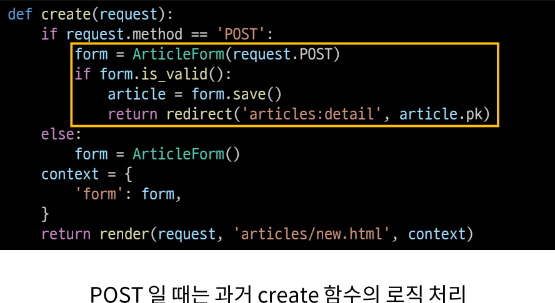
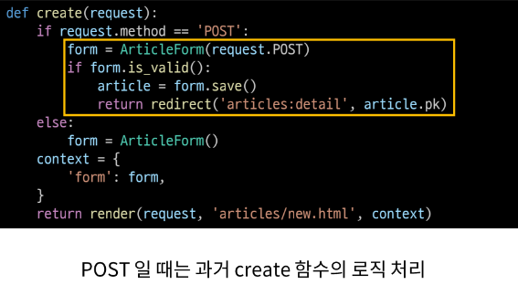
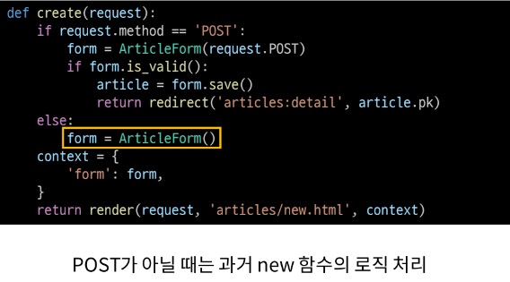
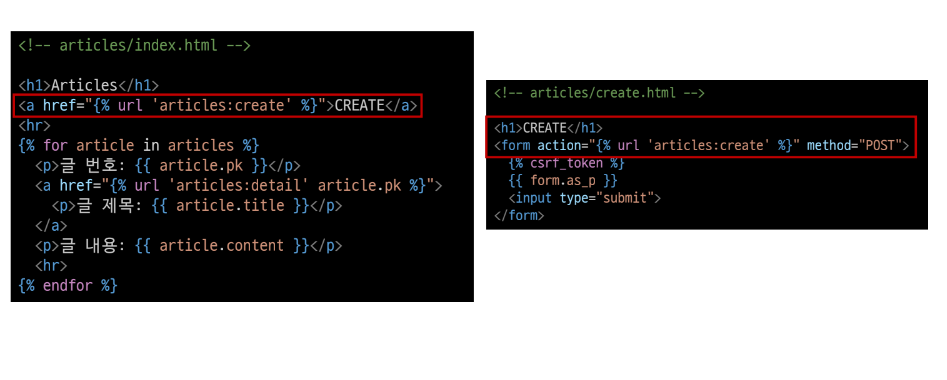
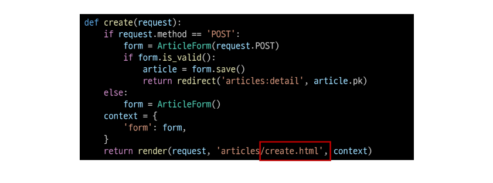
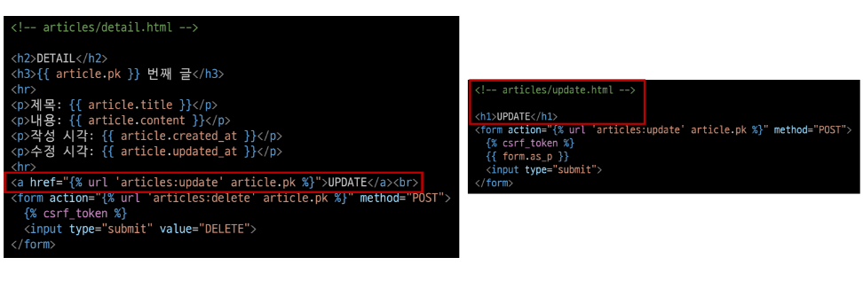

# 1. 개요

## HTTP requests 처리에 따른 view 함수 구조 변화

## new & create view 함수 간 공통점과 차이점
1. 공통점
  - 데이터 생성 로직을 구현하기 위함

2. 차이점
  - new는 GET method 요청만을 처리한다.
  - create는 POST method 요청만을 처리한다.

# 2. view 함수의 변화

## new와 view 함수 결합
```python
def new(request):
  form = ArticleForm()
  context = {
    'form':form,
  }
  return render(request, 'articles/new.html', context)
```
## ➕
```python
def create(request):
  form = ArticleForm(request.POST)
  if form.is_valid():
    article = form.save()
    return redirect('articles:detail', article.pk)
  context = {
    'form':form,
  }
  return render(request, 'articles/new.html', context)
```
## :arrow_down:
```python
def create(request):
  if request.method == 'POST':
    form = ArticleForm(request.POST)
    if form.is_valid():
      article = form.save()
      return redirect('articles:detail', article.pk)
  else:
    form = ArticleForm()
  context = {
    'form':form,
  }
  return render(request, 'articles/new.html', context)
```

## 새로운 create view 함수








# new url 정리
- 불필요해진 new url 제거
```python
# articles/views.py

app_name = 'articles'
urlpatterns = [
  path('', views.index, name='index'),
  # path('new/', views.new, name='new'),
  path('create/', views.create, name='create'),

  path('<int:pk>/', views.detail, name='detail'),  # 데이터 조회에 대한 URL 패턴

  path('<int:article_pk>/edit/', views.edit, name='edit'),   # 데이터 수정 페이지에 대한 URL 패턴

  path('<int:artilce_pk>/delete/', views.delete, name='delete'),   # 데이터 삭제에 대한 URL 패턴

  path('<int:article_pk>/update/', views.update, name='update'), # 데이터 수정 로직에 대한 URL 패턴
]
```

## 기존 new 관련 코드 수정




## :star:

### (GET) articles/create/ : 게시글 생성 페이지를 줘!!
### (POST) articles/create/ : 게시글을 생성해줘!!

## 새로운 update view 함수
```python
def update(request, article_pk):
  article = Article.objects.get(pk=article_pk)
  if request.method=='POST':
      form = ArticleForm(request.POST, instance=article)
      if form.is_valid():
          form.save()
          return redirect('articles:detail',article.pk)

  else:
      # 기존 데이터를 인자에 넣어줘야한다.key를 instance로 써야한다. (기존인자 article)
      form = ArticleForm(instance=article)
  context = {
      'article': article, # edit쪽에서 urls로 쓰이고있다.
      'form':form,
  }

  return render(request, 'articles/edit.html', context)
```

## edit url 정리
- 불필요해진 edit url 제거
```python
app_name = 'articles'
urlpatterns = [
  path('', views.index, name='index'),
  # path('new/', views.new, name='new'),
  path('create/', views.create, name='create'),
  path('<int:pk>/', views.detail, name='detail'),
  # path('<int:article_pk>/edit/', views.edit, name='edit'),
  path('<int:artilce_pk>/delete/', views.delete, name='delete'),
  path('<int:article_pk>/update/', views.update, name='update'),
]
```

## 기존 edit 관련 코드 수정
