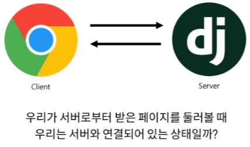

# 1. 개요

## HTTP
- HTML 문서와 같은 리소스들을 가져올 수 있도록 해주는 규약
- 웹(WWW)에서 이루어지는 모든 데이터 교환의 기초

## HTTP 특징
1. 비 연결 지향(connectionless)
  - 서버는 요청에 대한 응답을 보낸 후 연결을 끊음

2. 무상태(stateless)
  - 연결을 끊는 순간 클라이언트와 서버 간의 통신이 끝나며 상태 정보가 유지되지 않음

## 무상태로 인한 문제
- 장바구니에 담은 상품을 유지할 수 없음
- 로그인 상태를 유지할 수 없음
- ...

# 2. 쿠키(Cookie)
- `서버`가 `사용자`의 웹 브라우저에 `전송`하는 작은 데이터 조각
- `클라이언트 측에서 저장`되는 작은 데이터 파일이며, 사용자 인증, 사용자 추적, 상태 유지 등에 사용되는 데이터 저장 방식

## 쿠키 사용 예시

1. 브라우저(클라이언트)는 쿠키를 로컬에 KEY-VALUE의 데이터 형식으로 저장
2. 이렇게 쿠키를 저장해 놓았다가, 동일한 서버에 재요청 시 저장된 쿠키를 함께 전송
- 쿠키는 두 요청이 동일한 브라우저에서 들어왔는지 아닌지를 판단할 때 주로 사용됨
  - 이를 이용해 사용자의 로그인 상태를 유지할 수 있음
  - 상태가 없는(stateless) HTTP 프로토콜에서 상태 정보를 기억시켜주기 때문

## 쿠키 사용 목적
1. 세션 관리(Session management)
  - 로그인, 아이디 자동완성, 공지 하루 안 보기, 팝업 체크, 장바구니 등의 정보 관리
2. 개인화(Personalization)
  - 사용자 선호, 테마 등의 설정
3. 트래킹(Tracking)
  - 사용자 행동을 기록 및 분석
# :bulb:
## 응답한 서버로부터 쿠키를 받아 브라우저에 저장하고,
## 클라이언트가 같은 서버에 재요청 시마다
## 저장해 두었던 쿠키도 요청과 함께 전송한다.
## -> `로그인 되어있다는 사실을 입증할 데이터를 계속 보내는 것` 

## 세션(Session)
- 서버 측에서 생성되어 클라이언트와 서버 간의 상태를 유지
- 상태 정보를 저장하는 데이터 저장 방식
- `쿠키에 세션 데이터를 저장하여 매 요청시마다 세션 데이터를 함께 보냄`

## 세션 작동 예시
1. 클라이언트가 로그인을 하면 `서버`가 `session 데이터를 생성 후 저장`
2. 생성된 session 데이터에 인증할 수 있는 session id를 발급 (key를 제공하고 value는 DB에 저장되어 있음)
3. 발급한 session id를 클라이언트에게 응답
4. 클라이언트는 응답 받은 session id를 쿠키에 저장
5. 클라이언트가 다시 동일한 서버에 접속하면 요청과 함께 쿠키(session id가 저장된)를 서버에 전달
6. 쿠키는 요청 때마다 서버에 함께 전송되므로 서버에서 session id를 확인해 로그인 되어있다는 것을 알도록 함

## 세션은 서버 측에서 저장됨  
## 서버 측에서 세션 ID를 생성하고,
## 이 ID를 클라이언트 측으로 전달하여,
## 클라이언트는 쿠키에 이 ID를 저장

## 쿠키와 세션의 목적
- 클라이언트와 서버 간의 상태를 `유지`

# :star: 쿠키, 세션 특징 및 차이
1. 공통점 : 웹 통신간 `유지하려는 정보`(ex. 로그인 정보 등)를 저장하기 위해 사용한다.
2. 차이점 : 저장위치, 저장형식, 용량제한, 만료시점 등
  - 쿠키 : `개인 PC`에 저장
  - 세션 : 접속 중인 `웹 서버`에 저장

## :question: 세션을 쓰면 되는 데 굳이 쿠키를 사용하는 이유?
- 세션이 쿠키에 비해 `보안도는 높은 편`이나 세션은 `서버에 저장`되고,
- 서버자원을 사용하기 때문에 사용자가 많을 경우 `소모되는 자원이 상당`하다.
- 이러한 자원관리 차원에서 쿠키와 세션을 적절한 요소 및 기능에 병행 사용하며,
- 서버 자원의 낭비를 방지하며 웹 사이트의 속도를 높일 수 있다.

# 참고

## 쿠키 종류별 Lifetime(수명)

1. Session cookie
  - 현재 세션(current session)이 종료되면 삭제됨
  - 브라우저 종료와 함께 세션이 삭제됨

2. Persistent cookies
  - Expires 속성에 지정된 날짜 혹은 Max-Age 속성에 지정된 기간이 지나면 삭제됨

## 세션 in Django
- Django는 'database-backed sessions' 저장 방식을 기본 값으로 사용
- session 정보는 DB의 `django_session` 테이블에 저장
- Django는 특정 session id를 포함하는 쿠키를 사용해서 각각의 브라우저와 사이트가 연결된 session을 알아냄
- Django는 우리가 session 메커니즘(복잡한 동작원리)에 대부분을 생각하지 않게끔 많은 도움을 줌