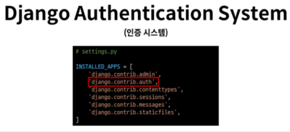
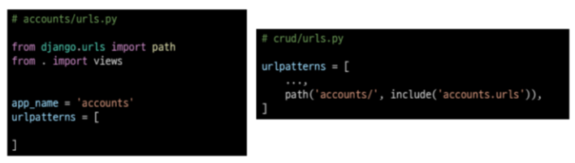
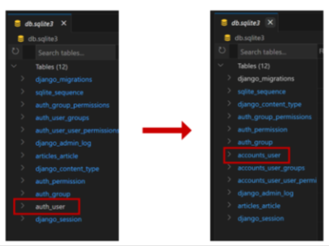
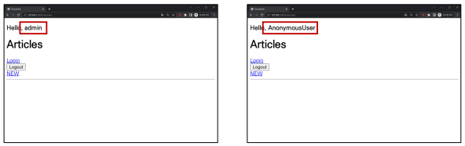
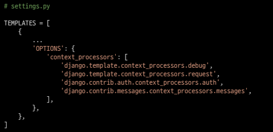
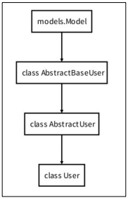

# 1. 개요

## 1-1 Django Authentication System (인증 시스템)
- 사용자 인증과 관련된 기능을 모아 놓은 시스템
- `인증과 권한 부여를 함께 제공 및 처리`



## 1-2 Authentication (인증)
- 사용자가 자신이 누구인지 확인하는 것
- `신원 확인`

## 1-3 Authorization (권한, 허가)
- 인증된 사용자가 수행할 수 있는 작업을 결정
- `권한 부여`

## 1-4 사전 설정
- 두 번째 app accounts 생성 및 등록
- `auth와 관련한 경로나 키워드들을 django 내부적으로 accoutns라는 이름으로 사용하고 있기 때문에 되도록 accounts로 지정하는 것을 권장`



# 2. Custom User model

## 2-1 Custom User model로 대체하기
- django가 기본적으로 제공하는 User model은 내장된 auth 모듈의 User 클래스를 사용
- `별도의 설정없이 사용할 수 있어 간편하지만, 직접 수정할 수 없는 문제를 해결하기 위해`

## 2-2 대체하기

### 1. 순서
- AbstractUser를 상속받는 커스텀 User 클래스 작성
- 기존 User 클래스도 AbstractUser를 상속받기 때문에 커스텀 User 클래스도 완전히 같은 모습을 가지게 된다.

```python
# accounts/models.py
from django.contrib.auth.models import AbstractUser

class User(AbstractUser):
  pass
```
### 2. 순서
- django 프로젝트가 사용하는 기본 User 모델을 우리가 `작성한 User 모델로 지정`
  - (수정 전 기본 값은 'auth.User')

```python
# setting.py
AUTH_USER_MODEL = 'accounts,User'
```
### 3. 순서
- 기본 User 모델이 아니기 때문에 `등록하지 않으면 admin site에 출력되지 않는다.`
```python
# accounts/admin.py
from django.contrib import admin
from django.contrib.auth.admin import UserAdmin
from .models import User

admin.site.register(User, UserAdmin)
```
## :exclamation: [주의]
## 프로젝트 중간에 AUTH_USER_MODEL을 변경할 수 없음
- 이미 진행할 경우 데이터베이스 초기화 후 진행 필요

## 2-3 기본 User 테이블의 변화


## 2-4 반드시 User 모델을 대체해야 할까:question:
- Django는 새 프로젝트를 시작하는 경우 비록 기본 User 모델이 충분하더라도 `커스텀 User 모델을 설정하는 것을 강력하게 권장(highly recommended)`
- `커스텀 User 모델`은 기본 User 모델과 동일하게 작동하면서도 필요한 경우 `나중에 맞춤 설정`할 수 있기 때문이다.
- 단, User 모델 대체 작업은 프로젝트의 모든 migrations 혹은 첫 migrate를 실행하기 전에 이 작업을 마쳐야한다.

# 3. Login
- Session을 Create하는 과정

## 3-1 AuthenticationForm()
- 로그인을 위한 built-in form

## 3-2 로그인 페이지 작성
```python
# accounts/urls.py

app_name = 'accounts'
urlpatterns = [
  path('login/', views.login, name='login'),
]
```
```python
# accounts/views.py
from django.contrib.auth.forms import AuthenticationForm

def login(request):
  if request.method == 'POST':
    pass
  else:
    form = AuthenticationForm()
  context = {
    'form':form,
  }
  return render(request, 'accounts/login.html', context)
```
```html
<!-- accounts/login.html -->

<h1>로그인<h1>
<form action="" method="POST">
  
  {{ form.as_p }}
  <input type="submit">
</form>
```

## 3-3 로그인 로직 작성
- `AuthenticationForm()` : 로그인을 위한 built-in form
- `login(request, user)` : 인증된 사용자를 로그인하는 함수
- `get_user()` : AuthenticationForm의 인스턴스 메서드, 유효성 검사를 통과했을 경우 로그인 한 사용자 객체를 반환
```python
# accounts/views.py

from django.shortcuts import render, redirect
from django.contrib.auth import login as auth_login

def login(request):
  if request.method == 'POST':
    from = AuthenticationForm(request, request.POST)
    if form.is_valid():
      auth_login(request, form.get_user())
      return redirect('articles:index')
  else:
    form = AuthenticationForm()
  context = {
    'form':form,
  }
  return render(request, 'accounts/login.html', context)
```

## 3-4 로그인 링크 작성
```html
<!-- articles/index.html -->
<h1>Articles</h1>
<a href="">Login</a>
<a href="">NEW<a>
```

# 4. Logout
- Session을 Delete하는 과정

## 4-1 logout(request)
1. 현재 요청에 대한 session data를 DB에서 삭제
2. 클라이언트의 쿠키에서도 sessionid를 삭제

## 4-2 로그아웃 로직 작성
```python
# accounts/urls.py

urlpatterns = [
  path('login/', views.login, name='login'),
  path('logout/', views.logout, name='logout'),
]
```
```python
# accounts/views.py
from django.contrib.auth import logout as auth_logout

def logout(request):
  auth_logout(request)
  return redirect('articles:index')
```
```html
<!-- articles/index.html -->

<h1>Articles<h1>
<a href="">Login<a>
<form action="" method="POST">
  
  <input type="submit" value="Logout">
</form>
```

# 5. Template with Authentication data
- 템플릿에서 인증 관련 데이터를 출력하는 방법

## 5-1 현재 로그인 되어있는 유저 정보 출력하기
```html
<!-- articles/index.html -->

<h3>Hello, {{ user }}</h3>
```


## 5-2 context processors
- 템플릿이 렌더링 될 때 호출 가능한 컨텍스트 데이터 목록
- 작성된 컨텍스트 데이터는 기본적으로 템플릿에서 사용 가능한 변수로 포함됨
- 즉, django에서 자주 사용하는 데이터 목록을 미리 템플릿에 로드해 둔 것



# 참고

## User 모델 상속 관계


## 'AbstractUser' class
- "관리자 권한과 함께 완전한 기능을 가지고 있는 User model을 구현하는 추상 기본 클래스"
- Abstract base classes(추상 기본 클래스)
  - 몇 가지 공통 정보를 여러 다른 모델에 넣을 때 사용하는 클래스
  - 데이터베이스 테이블을 만드는 데 사용되지 않으며, 대신 다른 모델의
  - 기본 클래스로 사용되는 경우 해당 필드가 하위 클래스의 필드에 추가됨