# 1. 개요

## User 객체와 CUD
- 회원 가입
- 회원 탈퇴
- 회원정보 수정
- 비밀번호 변경

# 2. 회원 가입
- User 객체를 Create 하는 것

## 2-1 UserCreationForm()
- 회원 가입을 위한 built-in ModelForm

## 2-2 회원 가입 페이지 작성
```python
# acounts/urls.py

app_name = 'accounts'
urlpatterns = [
  ...,
  path('signup/', views.signup, name='signup'),
]
```
```python
# accounts/views.py
from django.contrib.auth.forms import UserCreationForm

def signup(request):
  if request.method == 'POST':
    pass
  else:
    form = UserCreationForm()
  context = {
    'form':form,
  }
  return render(request, 'accounts/signup.html', context)
```
```html
<!-- accounts/signup.html -->

<h1>회원가입<h1>
<form action="" method="POST">
  
  {{ form.as_p }}
  <input type="submit">
</form>
```

## 2-3 회원 가입 로직 작성
```python
# accounts/views.py

def signup(request):
  if request.method ='POST':
    form = UserCreationForm(request.POST)
    if form.is_valid():
      form.save()
      return redirect('articles:index')
  else:
    form = UserCreationForm()
  context = {
    'form':form,
  }
  return render(request, 'accounts/signup.html', context)
```

## :bulb: 회원가입 진행 후 에러 페이지 확인 :heavy_exclamation_mark:

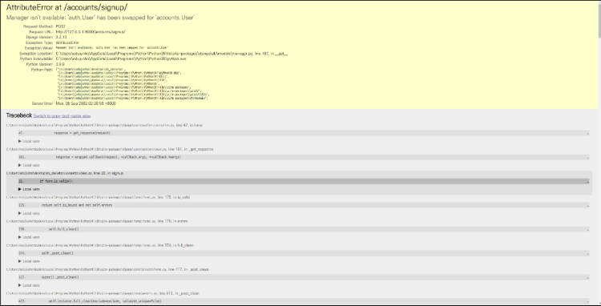

### :star: 회원가입에 사용하는 UserCreationForm이 우리가 대체한 커스템 유저 모델이 아닌 기존 유저 모델로 인해 작성된 클래스이기 때문이다.

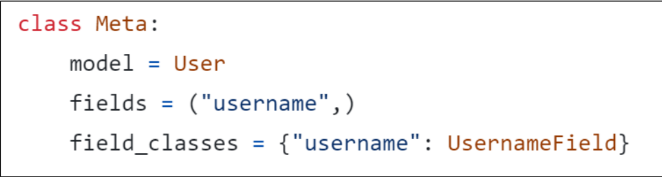

## 2-4 커스텀 유저 모델을 사용하려면 다시 작성해야 하는 forms
### UserCreationForm / UserChangeForm
- 두 form 모두 class Meta: model=User가 등록된 form이기 때문

## 2-5 커스텀 Form 작성
```python
# accounts/forms.py

from django.contrib.auth import get_user_model
from django.contrib.auth.forms import UserCreationForm, UserChangeForm

class CustomUserCreationForm(UserCreationForm):
  class Meta(UserCreationForm.Meta):
    model = get_user_model()

class CustomUserChangeForm(UserChangeForm):
  class Meta(UserChangeForm.Meta):
    model = get_user_model()
```

## 2-6 get_user_model()
- "현재 프로젝트에서 활성화된 사용자 모델(active user model)"을 반환하는 함수

## 2-7 User 모델을 직접 참조하지 않는 이유
- User 모델을 get_user_model()을 사용해 참조하면 `커스텀 User 모델`을 자동으로 반환해주기 때문
- Django는 User 클래스를 직접 참조하는 대신 `get_user_model()을 사용해 참조`해야 한다고 강조

## 2-8 회원 가입 로직 수정
```python
# accounts/views.py
from .forms import CustomUserCreationForm

def signup(request):
  if request.method=='POST':
    form = CustomUserCreationForm(request.POST)
    if form.is_valid():
      form.save()
      return redirect('articles:index')
  else:
    form = CustomUserCreationForm()
  context = {
    'form':form,
  }
  return render(request, 'accounts/signup.html', context)
```

# 3. 회원 탈퇴
- User 객체를 Delete 하는 것

## 3-1 회원 탈퇴 로직 작성
```python
# accounts/urls.py

app_name='accounts'
urlpatterns =[
  ...,
  path('delete/', views.delete, name='delete'),
]
```
```python
# accounts/views.py

def delete(request):
  request.user.delete()
  return redirect('articles:index')
```
```html
<!-- accounts/index.html -->

<form action="" method="POST">
  
  <input type="submit" value="회원탈퇴">
</form>
```

# 4. 회원정보 수정
- User 객체를 Update 하는 것

## 4-1 UserChangeForm()
- 회원 가입을 위한 built-in  ModelForm

## 4-2 회원정보 수정 페이지 작성
```python
# accounts/url.py

app_name='accounts'
urlpatterns = [
  ...,
  path('update/', views.update, name='update'),
]
```
```python
# accounts/views.py
from .forms import CustomUserChangeForm

def update(request):
  if request.method=='POST':
    pass
  else:
    form = CustomUserChangeForm(instance=request.user)
  context = {
    'form':form,
  }
  return render(request, 'accounts/update.html', context)
```
```html
<!-- accounts/update.html -->

<h1>회원정보 수정<h1>
<form action="" method="POST">
  
  {{ form.as_p }}
  <input type="submit">
</form>
```

## 4-3 회원정보 수정 페이지 작성
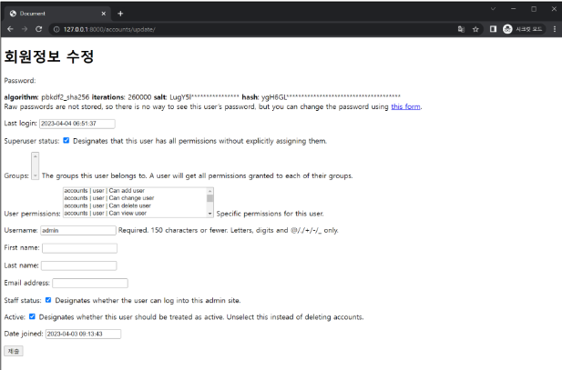

## 4-4 UserChangeForm 사용 시 문제점
- 일반 사용자가 접근해서는 안 될 정보들(fields)까지 모두 수정이 가능해짐
- admin 인터페이스에서 사용되는 ModelForm이기 때문이다.
- 따라서 CustomUserChangeForm에서 접근 가능한 필드를 조정해야 함

## 4-5 CustomUserChangeForm fields 재정의
- User Model의 필드
```python
# accounts/forms.py

class CustomUserChangeForm(UserChangeForm):
  class Meta(UserChangeForm.Meta):
    model = get_user_model()
    fields = ('email', 'first_name', 'last_name',)
```

## 4-6 회원정보 수정 로직 작성
```python
# accounts/views.py
from .forms import CustomUserChangeForm

def update(request):
  if request.method=='POST':
    form = CustomUserChangeForm(request.POST, instance=request.user)
    if form.is_valid():
      form.save()
      return redirect('articles:index')
  else:
    form = CustomUserChangeForm(instance=request.user)
  context = {
    'form':form,
  }
  return render(request, 'accounts/update.html', context)
```

# 5. 비밀번호 변경

## 5-1 비밀번호 변경 페이지
- django는 비밀번호 변경 페이지를 회원정보 수정 form에서 별도 주소로 안내
  - /accounts/password/

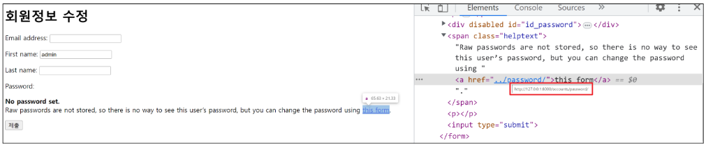

## 5-2 PasswordChangeForm()
- 비밀번호 변경을 위한 built-in Form

## 5-3 비밀번호 변경 페이지 작성
```python
# accounts/urls.py

app_name='accounts'
urlpatterns = [
  ...,
  path('password/', views.change_password, name='change_password'),
]
```
```python
# accounts/views.py
from django.contrib.auth.forms import PasswordChangeForm

def change_password(request):
  if request.method === 'POST':
    pass
  else:
    form = PasswordChangeForm(request.user)
  context = {
    'form':form,
  }
  return render(request, 'accounts/change_password.html', context)
```
```html
<!-- accounts/change_password.html -->

<h1>비밀번호<h1>
<form action="" method="POST">
  
  {{ form.as_p }}
  <input type="submit">
</form>
```

## 5-4 PasswordChangeForm의 인자 순서

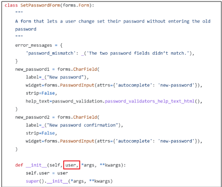

## 5-5 비밀번호 변경 로직 작성
```python
# accounts/views.py
from django.contrib.auth.forms import PasswordChangeForm

def change_password(request):
  if request.method === 'POST':
    form = PasswordChangeForm(request.user, request.POST)
    if form.is_valid():
      form.save()
      return redirect('articles:index')
  else:
    form = PasswordChangeForm(request.user)
  context = {
    'form':form,
  }
  return render(request, 'accounts/change_password.html', context)
```

## 5-5 암호 변경 시 세션 무효화
- 비밀번호가 변경되면 기존 세션과의 회원 인증 정보가 일치하지 않게 되어버려 로그인 상태가 유지되지 못함
- 비밀번호는 잘 변경되었으나 비밀번호 변경되면서 기존 세션과의 회원 인증 정보가 일치하지 않기 때문

## 5-6 update_session_auth_hash(request, user)
- "암호 변경 시 세션 무효화 방지"
- 암호가 변경되어도 로그아웃 되지 않도록 새로운 password의 session data로 기존 session을 업데이트

## 5-7 update_session_auth_hash 적용

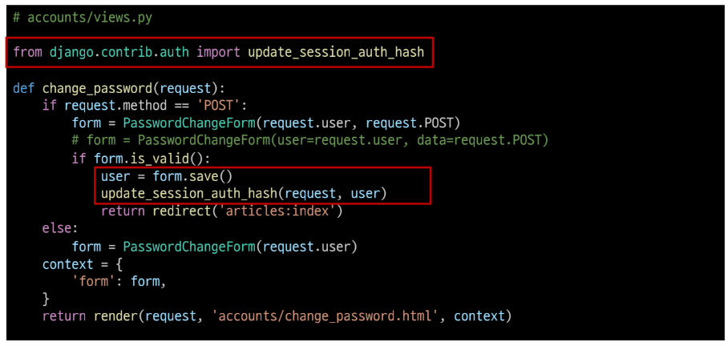

# 5. 로그인 사용자에 대한 접근 제한

## 5-1 로그인 사용자에 대해 접근을 제한하는 2가지 방법
1. is_authenticated : 속성
2. login_required : 데코레이터

## 5-2 is_authenticated
- 사용자가 인증되었는지 여부를 알 수 있는 User model의 속성(attributes)
- 모든 User 인스턴스에 대해 항상 True인 읽기 전용 속성이며, AnonymousUser에 대해서는 항상 False임
- `권한(permission)과는 관련이 없으며, 사용자가 활성화 상태(active)이거나 유효한 세션(valid session)을 가지고 있는 지도 확인하지 않음

## 5-3 is_authenticated 적용하기
- 로그인과 비로그인 상태에서 출력되는 링크를 다르게 설정하기

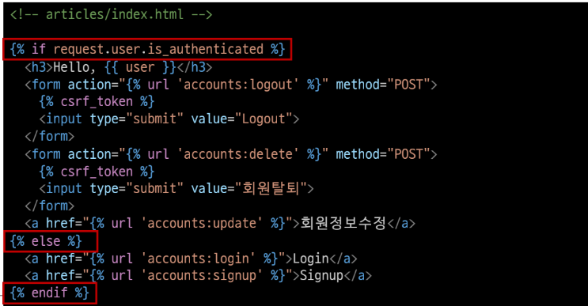

- 인증된 사용자라면 로그인/회원가입 로직을 수행할 수 없도록 처리하기

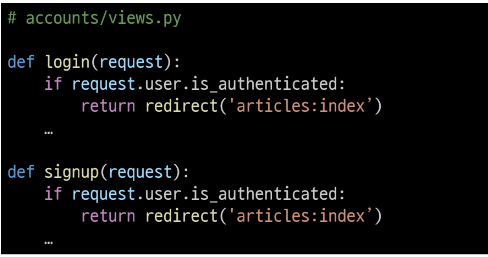

## 5-4 login_required
- 인증된 사용자에 대해서만 view 함수를 실행시키는 데코레이터
- 로그인 하지 않은 사용자의 경우 /accounts/login/ 주소로 redirect시킴

## 5-5 login_required 적용하기
- 인증된 사용자만 게시글을 작성/수정/삭제할 수 있도록 수정

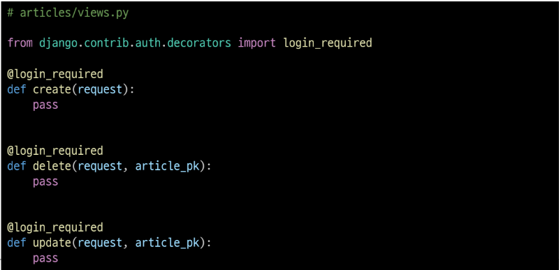

- 인증된 사용자만 게시글을 로그아웃/탈퇴/수정/비밀번호 변경할 수 있도록 수정

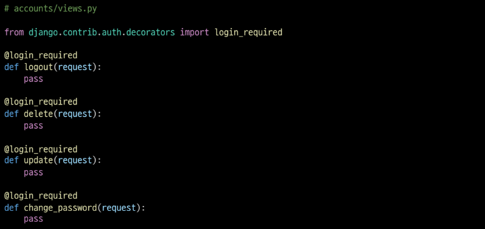

# 참고

## 1. 데코레이터(Decorator)
- 기존에 작성된 함수에 기능을 추가하고 싶을 때, 해당 함수를 수정하지 않고 기능만을 추가해주는 함수

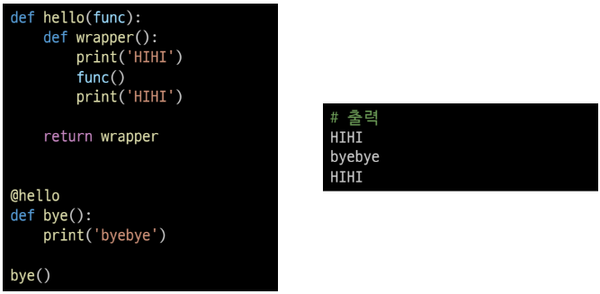

## 2. is_authenticated

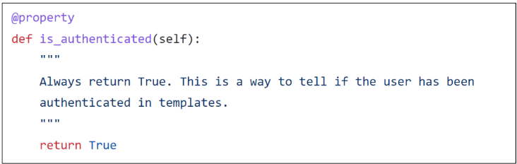

## 3. 회원가입 후 로그인까지 진행하려면

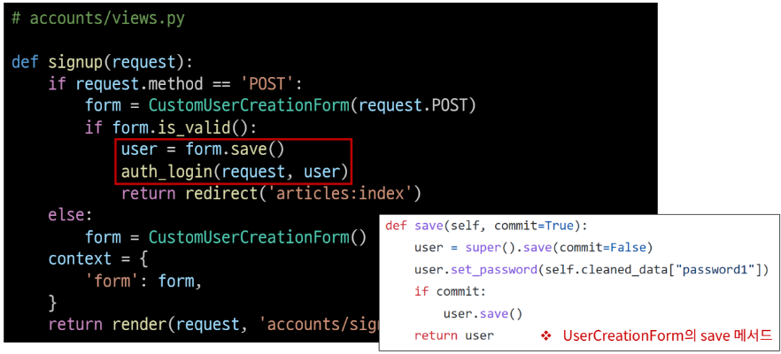

## 4. 탈퇴하면서 유저의 세션 정보도 함께 지우고 싶을 경우
- "탈퇴(1) 후 로그아웃(2)"의 순서가 바뀌면 안됨
- 먼저 로그아웃 해버리면 해당 요청 객체 정보가 없어지기 때문에 탈퇴에 필요한 유저 정보 또한 없어지기 때문
```python
# accounts/views.py

def delete(request):
  request.user.delete()
  auth_logout(request)
```