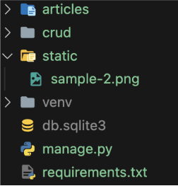

# 1. 개요

## 1-1 Static Files
- 서버 측에서 변경되지 않고 고정적으로 제공되는 파일 (이미지, JS, CSS 파일 등)

## 1-2 웹 서버와 정적 파일 (1/2)


# 2. static files 제공하기

## 2-1 경로에 따른 Static file 제공하기

- 기본 경로 : app/static/
- 추가 경로 : STATICFILES_DIRS

## 2-2 기본 경로 static file 제공하기

1. articles/static/articles/ 경로에 이미지 파일 배치


2. static tag를 사용해 이미지 파일에 대한 url 제공


3. STATIC_URL 경로 확인


## 2-3 STATIC_URL

- 기본 경로 및 추가 경로에 위치한 정적 파일을 참조하기 위한 URL
- 실제 파일이나 디렉토리가 아니며, URL로만 존재
- `비어 있지 않은 값으로 설정 한다면 반드시 slash(/)로 끝나야함`
```python
# settings.py

STATIC_URL = '/static/'
```


## 2-4 추가 경로 static file 제공하기

1. 추가 경로에 이미지 파일 배치
```python
# settings.py

STATICFILES_DIRS = [
  BASE_DIR / 'static',
]
```

2. 추가 경로에 이미지 파일 배치



3. static tag를 사용해 이미지 파일에 대한 url 제공
```html
<!-- articles/index.html -->


```

## 2-5 STATICFILES_DIRS
- 정적 파일의 기본 경로 외에 추가적인 경로 목록을 정의하는 리스트


- 정적 파일을 제공하기 위해서는 요청할 URL이 필요하다.

# 3. Media Files
- 사용자가 웹에서 업로드하는 정적 파일 (user-uploaded)

## 3-1 ImageField()
- 이미지 업로드에 사용하는 모델 필드
- `이미지 객체가 직접 저장되는 것이 아닌 '이미지 파일의 경로 문자열'이 DB에 저장`

## 3-2 미디어 파일을 제공하기 전 준비

1. settings.py에 MEDIA_ROOT, MEDIA_URL 설정
2. 작성한 MEDIA_ROOT와 MEDIA_URL에 대한 url 지정

## 3-3 MEDIA_ROOT
- 미디어 파일들이 위치하는 디렉토리의 절대 경로
```python
# settings.py

MEDIA_ROOT = BASE_DIR / 'media'
```

## 3-4 MEDIA_URL
- MEDIA_ROOT에서 제공되는 미디어 파일에 대한 주소를 생성 (STATIC_URL과 동일한 역할)
```python
# settings.py

MEDIA_URL = '/media/'
```

## 3-5 MEDIA_ROOT와 MEDIA_URL에 대한 url 지정


# 4. 이미지 업로드 및 제공하기

## 4-1 이미지 업로드
1. blank=True 속성을 작성해 빈 문자열이 저장될 수 있도록 설정


- `기존 필드 사이에 작성해도 실제 테이블 생성시에는 가장 우측(뒤)에 추가됨`

2. migration 진행
```cdn
$ pip install pillow

$ python manage.py makemigrations
$ python manage.py migrate

$ pip freeze > requirements.txt
```
- `ImageField를 사용하려면 반드시 pillow 라이브러리가 필요`

3. form 요소의 enctype 속성 추가
```html
<!-- articles/create.html -->

<h1>CREATE<h1>
<form action"" method="POST" enctype="multipart/form-date">
  
  {{ form.as_p }}
  <input type="submit">
</form>
```

4. view 함수에서 업로드 파일에 대한 추가 코드 작성
```python
# articles/views.py

def create(request):
  if request.method == 'POST':
    form = ArticleForm(request.POST, request.FILSE)
...
```

5. 이미지 업로드 결과


## 4-2 업로드 이미지 제공하기

1. url 속성을 통해 업로드 파일의 경로 값을 얻을 수 있음
```html
<!-- articles/detail.html -->


```
- article.image.url - 업로드 파일의 경로
- article.image - 업로드 파일의 파일 이름

2. 업로드 출력 확인 및 MEDIA_URL 확인


3. 이미지 데이터가 있는 경우만 이미지를 출력할 수 있도록 처리
- 이미지를 업로드하지 않은 게시물은 detail 템플릿을 출력할 수 없는 문제 해결

```html
<!-- articles/detail.html -->


  

```

4. 수정 페이지 form 요소에 enctype 속성 추가

```html
<!-- articles/update.html -->

<h1>UPDATE</h1>
<form action="" method="POST" enctype="multipart/form-data">
  
  {{ form.as_p }}
  <input type="submit">
</form>
```

5. view 함수에서 업로드 파일에 대한 추가 코드 작성
```python
# articles/views.py

def update(request, pk):
  article = Article.objects.get(pk=pk)
  if request.method == "POST":
    form = ArticleForm(request.POST, request.FILES, instance=article)
  ...
```

# 참고

## 1. 'upload_to' argument
- ImageField()의 upload_to 인자를 사용해 미디어 파일 추가 경로 설정


## 2. request.FILES가 두 번째 위치 인자인 이유
- ModelForm 상위 클래스의 생성자 함수 참고

