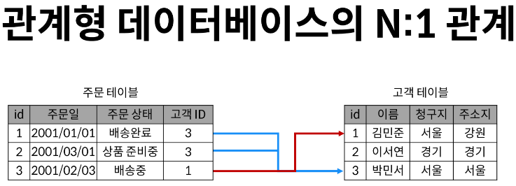
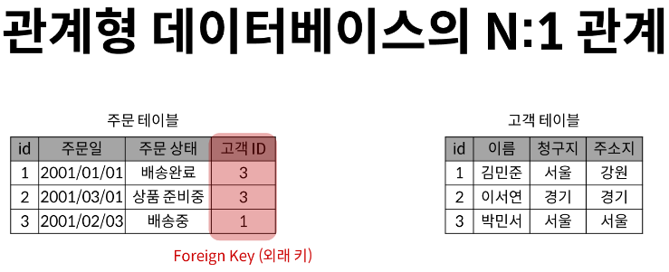
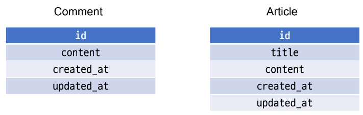
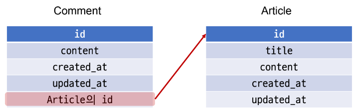
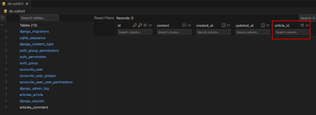
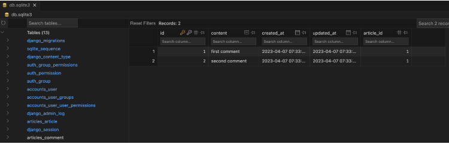
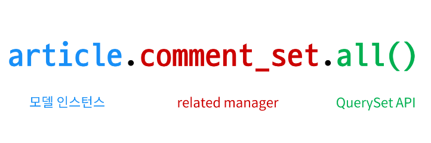
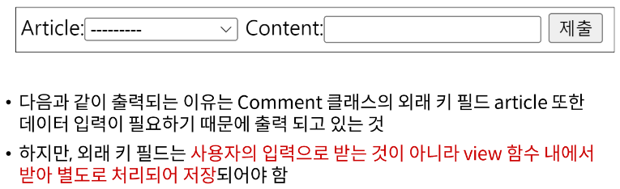
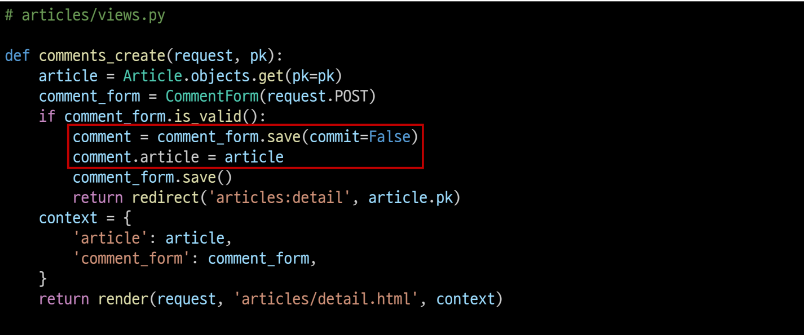
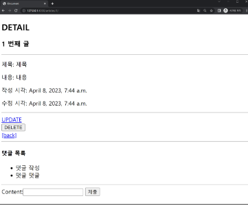

# 1. 개요





## Foreign Key
- 테이블의 필드 중 다른 테이블의 레코드르 식별할 수 있는 키
- 각 레코드에서 서로 다른 테이블 간의 '관계'를 만드는 데 사용

# 2. Comment & Article

# 2-1 모델 관계 설정

## 2-1-1 Many to one relationships (N:1 or 1:N)
- `한 테이블(주문)의 0개 이상`의 `레코드가 다른 테이블(고객)의 레코드 한 개`와 관련된 관계
  - 주문(N) - 고객(1) / 주문은 0개 이상
  - 즉 무조건 고객 하나 당 주문 한 개가 있는 것이 아니다.
  - 주문 한 개당 무조건 고객 1명이 있다.

## 2-1-2 Comment(N) - Article(1)
- '0개 이상의 댓글은 1개의 게시글에 작성될 수 있다.'
- `ForeignKey는 N쪽에서 들고 있을 수 밖에 없다.`

## 2-1-3 두 모델의 관계
- Comment가 Article을 참조하는 형태가 되어야 하기 때문에 ForeignKey는 Comment에 생성한다.





### 외래키를 들고 있는 입장에서 N(Comment) -> 1(N)은 `참조`, N(Comment) <- 1(N)은 `역참조`
### 현재 물리적으로 역참조는 위 구조로 봤을 떄는 불가능하다. Comment에 대한 정보가 Article에 저장되지 않기 때문에

## 2-1-4 ForeignKey()
- django에서 N:1 관계 설정 모델 필드

## 2-1-5 Comment 모델 정의
```python
# articles/models.py

class Comment(models.Model):
  article = models.ForeignKey(Article, on delete=models.CASCADE)
  content = models.CharField(max_length=200)
  created_at = models.DateTimeField(auto_now_add=True)
  updated_at = models.DateTimeField(auto_now=True)
```
- ForeignKey() 클래스의 인스턴스 이름은 참조하는 모델 클래스 이름의 단수형(소문자)으로 작성하는 것을 권장
- ForeignKey 클래스를 작성하는 위치와 관계없이 필드 마지막에 생성된다.

## 2-1-6 ForeignKey(to, on_delete)
- `to` : "참조하는 모델 class 이름"
- `on_delete` : "참조하는 모델 class가 삭제될 때 연결된 하위 객체의 동작을 결정"

## 2-1-7 on_delete
- 외래 키가 참조하는 `객체(1)가 사라졌을 때, 외래 키를 가진 객체(N)을 어떻게 처리할 지`를 정의하는 설정(데이터 무결성)
- "CASCADE" : 부모 객체(참조된 객체)가 삭제됐을 때 이를 참조하는 객체도 삭제

## 2-1-8 Migration 진행 후 Comment 테이블 확인
- article_id 필드 확인
- 참조하는 클래스 이름의 소문자(단수형)로 작성하는 것이 권장되었던 이유



## 2-1-9 댓글 생성 연습하기
### 1. shell_plus 실행 및 게시글 작성
```python
$ python manage.py shell_plus

# 게시글 생성
Article.objects.create(title='title', content='content')
```

### 2. 댓글 생성
```python
# Comment 클래스의 인스턴스 comment 생성
comment = Comment()

# 인스턴스 변수 저장
comment.content = 'first comment'

# DB에 댓글 저장
comment.save()

# 에러 발생
django.db.utils.IntergrityError: NOT NULL constraint failed: articles_comment.article.id
# articles_comment 테이블의 ForeignKeyField, article_id 값이 저장 시 누락되었기 때문
```

### 3. 댓글 생성 연습하기
```python
# 게시글 조회
article = Article.objects.get(pk=1)

# 외래 키 데이터 입력 (댓글이 몇 번 article 글에 작성된 건 지 찾아내기 위해)
comment.article = article # comment.article(인스턴스 변수) = article(위에서 가져온 pk=1인 글)
# 또는 comment.article_id = article.pk처럼 pk값을 직접 외래 키 컬럼에
# 넣어 줄 수도 있지만 권장하지 않음

# DB에 댓글 저장 및 확인
comment.save()
```

### 4. comment 인스턴스를 통한 article 값 접근하기
```python
comment.pk
=> 1

comment.content
=> 'first comment'

# 클래시 변수명인 article로 조회 시 해당 참조하는 게시물 객체를 조회할 수 있음
comment.article
=> <Article: Article object (1)>

# article_pk는 존재하지 않는 필드이기 때문에 사용 불가 (아래 표기는 권장하지 않는다.)
comment.article_id
=> 1
```

### 5. 댓글 생성
```python
# 1번 댓글이 작성된 게시물의 pk 조회
comment.article.pk
=> 1

# 1번 댓글이 작성된 게시물의 content 조회
comment.article.content
=> 'content'
```

### 6. 두 번째 댓글 작성해보기
```python
coment = Comment(content='Second comment', article=article)
comment.save()

comment.pk
=> 2

comment
=> <Comment: Comment object (2)>

comment.article.pk
=> 1
```

### 7. 작성된 댓글 확인



# 2-2. 관계 모델 참조 (Comment & Article)

## 2-2-1 역참조
- 나를 참조하는 테이블(나를 외래 키로 지정한)을 참조하는 것
- N:1 관계에서는 1이 N을 참조하는 상황
- `하지만 Article에는 Comment를 참조할 어떠한 필드도 없다.`

## 2-2-2 article.comment_set.all()



## 2-2-3 related manager
- N:1 혹은 M:N 관계에서 역참조 시에 사용하는 manager
- (`objects`라는 매니저를 통해 `queryset api`를 사용했던 것처럼 `related manager`를 통해 `queryset api(all, get)`를 사용할 수 있게됨)

## 2-2-4 related manager가 필요한 이유

- article.comment 형식으로는 댓글 객체를 참조할 수 없음
- 실제 Article 클래스에는 comment와의 어떠한 관계도 작성되어 있지 않기 때문
- 대신 Django가 역참조할 수 있는 'comment_set' manager를 자동으로 생성해 article.comment_set 형태로 댓글 객체를 참조할 수 있다.
- N:1 관계에서 생성되는 Related manger의 이름은 참조하는 `"모델명_set"` 이름 규칙으로 만들어진다.

## 2-2-5 Related manager 연습하기

### 1. shell_plus 실행 및 1번 게시글 조회

```python
$ python manage.py shell_plus

article = Article.objects.get(pk=1)
```

### 2. 1번 게시글에 작성된 모든 댓글 조회하기 (역참조)
```python
>>> article.comment_set.all()
```

### 3. 1번 게시글에 작성된 모든 댓글 출력하기

```python 1번 게시글에 작성된 모든 댓글 출력하기
comments = article.comment_set.all()

for comment in comments:
  print(comment.content)
```

# 2-3 댓글 기능 구형 (comment & Article)

## 2-3-1 Comment CREATE

### 1. 사용자로부터 댓글 데이터를 입력 받기 위한 CommentForm 작성
```python
# articles/forms.py

from django import forms
from .models import Article, Comment

class ArticleForm(forms.ModelForm):
  class Meta:
      model = Article
      fields = '__all__'

# CommentForm 작성
class CommentForm(forms.ModelForm):
  class Meta:
      model = Comment
      fields = '__all__'
```

### 2. detail 페이지에서 Comment Form 출력 (view 함수)
```python
# articles/views.py
from .forms import ArticleForm, CommentForm

def detail(request, pk):
  article = Article.objects.get(pk=pk)
  # CommetForm의 인스턴스를 만들어준다.(그리고 context로 내려줘야 출력가능)
  comment_form = CommentForm()
  context = {
      'article': article,
      'comment_form':comment_form,
  }
  return render(request, 'articles/detail.html', context)
```

### 3. detail 페이지에서 CommentForm 출력 (템플릿)
```html
<!-- articles/detail.html -->
{{ comment.content}}
<form action="#" method="POST">
    
    <input type="submit">
</form>
```

### 4. CommentForm 출력 확인



### 5. detail 페이지에서 CommentForm 출력 (템플릿)
- forms.py에서 작성한 출력 필드를 수정해야한다.
- 앞에 Article(어디 게시물에 작성하는 것을 고를 수 있는)은 사용자가 선택하는 것이 아니기 때문에 숨겨야한다.
```python
# articles/forms.py

class CommentForm(forms.ModelForm):
  class Meta:
      model = Comment
      fields = ('content',)
```
### 6. Comment CREATE
- 출력에서 제외된 외래 키 데이터는 어디서 받아와야 할까?
- detail 페이지 url을 살펴보면 path('<int:pk>/', views.detail, name='detail') url에 해당 게시글의 pk 값이 사용되고 있음
- 댓글의 외래 키 데이터에 필요한 정보가 바로 게시글의 pk값

```python
# articles/urls.py
from django.urls import path
from . import views

app_name = 'articles'
urlpatterns = [
  path('', views.index, name='index'),
  path('create/', views.create, name='create'),
  path('<int:pk>/', views.detail, name='detail'),
  path('<int:artilce_pk>/delete/', views.delete, name='delete'),
  path('<int:article_pk>/update/', views.update, name='update'),

  path('<int:article_pk>/comments/', views.comment_create, name='comment_create'),
]
```
```python
# article/views.py

def comment_create(request, article_pk):
  # 몇 번 게시글인지 조회
  article = Article.objects.get(pk=article_pk)
  # 댓글 데이터를 받아서
  comment_form = CommentForm(request.POST)
  # 유효성 검증
  if comment_form.is_valid():
      # commit을 False로 지정하면 인스턴스는 반환(만들어주면서도)하면서도 DB에 레코드는 작성하지 않도록 함
      comment = comment_form.save(commit=False)
      comment.article = article
      comment_form.save() # save()는 기본값으로 save(commit=True)로 되어있다.
      return redirect('articles:detail', article.pk)
  context = {
      'article':article,
      'comment_form':comment_form,
  }
  return render(request, 'articles/detail.html', context)
```
```html
<!-- articles/detail.html-->

<form action="" method="POST">
  
  {{ comment_form }}
  <input type="submit">
</form>
```

## 2-3-2 save(`commit=False`)
- "Create, but don't save the new instance."
- DB에 저장하지 않고 인스턴스만 반환한다.
- `commit` : 레코드에 작성되는 것 (테이블에 한 줄 쓰는 것), 그것을 멈추기 위해 `commit=Flase`
- 레코드에 작성되기 전에 값을 넣기 위해서



## 2-3-3 Comment READ

### 1. 전체 댓글 출력 (view 함수)
```python
# articles/views.py

def detail(request, pk):
  article = Article.objects.get(pk=pk)
  comment_form = CommentForm()
  # 해당 게시글에 작성된 모든 댓글을 조회(역참조)
  comments = article.comment_set.all()
  context = {
      'article': article,
      'comment_form':comment_form,
      'comments':comments,
  }
  return render(request, 'articles/detail.html', context)
```

### 2. 전체 댓글 출력 (템플릿)
```html
<!-- articles/detail.html -->

<h4>댓글 목록</h4>
<ul>
  
    <li>
      {{ comment.content}}
    </li>
  
</ul>
```

### 3. 전체 댓글 출력 확인



## 2-3-4 Comment DELETE

### 1. 댓글 삭제 url 작성
```python
# articles/urls.py
from django.urls import path
from . import views


app_name = 'articles'
urlpatterns = [
  path('', views.index, name='index'),
  path('create/', views.create, name='create'),
  path('<int:pk>/', views.detail, name='detail'),
  path('<int:artilce_pk>/delete/', views.delete, name='delete'),
  path('<int:article_pk>/update/', views.update, name='update'),
  path('<int:article_pk>/comments/', views.comment_create, name='comment_create'),

  # 댓글을 삭제할 때 몇 번 댓글을 삭제해야 하는 지 (댓글 조회) => 댓글을 조회할 pk를 받아야 함
  # 댓글이 삭제된 이후 detail 페이지로 redirect => 몇 번 게시글의 detail이 필요하다 => 게시글을 조회할 pk도 필요
  path('<int:article_pk>/comments/<int:comment_pk>/delete/', views.comment_delete, name="comment_delete"),
]
```

### 2. 댓글 삭제 view 함수 작성
```python
# articles/views.py

def comment_delete(request, article_pk, comment_pk):
  # 삭제할 댓글을 조회
  comment = Comment.objects.get(pk=comment_pk)
  # 댓글 삭제
  comment.delete()
  return redirect('articles:detail', article_pk)
```

### 3. 댓글 삭제 버튼 작성
```html
<!-- articles/detail.html -->

<ul>
  
    <li>
      {{ comment.content}}
      <form action="" method="POST">
        
        <input type="submit" value="삭제">
      </form>
    </li>
  
</ul>
```