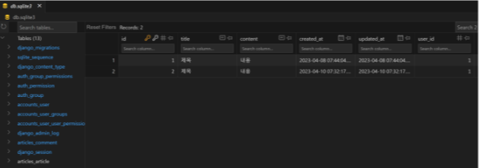
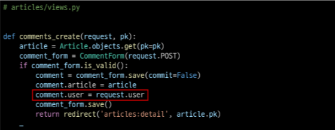

# 1. 개요

## Article(N) - User(1)
- 0개 이상의 게시글은 1개의 회원에 의해 작성될 수 있다.

## comment(N) - User(1)
- 0개 이상의 댓글은 1개의 회원에 의해 작성될 수 있다.

# 2. Article & User

# 2-1 모델 관계 설정

## 2-1-1 User 외래 키 정의
```python
# articles/models.py

from django.db import models
# from accounts.models import User (객체를 반환)

# 이전에 배웠던 get_user_model 함수를 사용 (models.py에서는 사용하지 않음)
# from django.contrib.auth import get_user_model (객체를 반환)

# django는 내부 실행 원리에서 장고가 실행했을 때 아직 user라는 객체가 생성되기 전에 models.py가 실행돼서 참조할 객체가 없다. 
# 그래서 그런 문제를 방지하기 위해서 문자열로 만들어 놓는다. => 직접참조 대신 간접참조를 한다.
# 문자열로 참조 시켜놓고 나중에 User가 만들어졌을 때 그때 문자열로 참조될 수 있게 처리한다.
# 간단하게 User 모델을 참조하는 2가지 방법이 있다. 대상은 같지만 반환값이 다른

# models.py에서 User를 참조할 때만 다음과 같이 참조한다.
from django.conf import settings 

# Create your models here.
class Article(models.Model):
  # user = models.ForeignKey(get_user_model, on_delete=models.CASCADE)
  user = models.ForeignKey(settings.AUTH_USER_MODEL, on_delete=models.CASCADE) # settings.AUTH_USER_MODEL은 문자열을 반환
  title = models.CharField(max_length=10)
  content = models.TextField()
  created_at = models.DateTimeField(auto_now_add=True)
  updated_at = models.DateTimeField(auto_now=True)
```

## 2-1-2 User 모델을 참조하는 2가지 방법


## 2-1-3  Migration 진행


# 2-2 CRUD 구현

## 2-2-1 Article CREATE

### 1. ArticleForm 출력 확인


### 2. ArticleForm 출력 필드 수정


### 3. 게시글 작성 시 user_id 필드 데이터가 누락되어 에러 발생


### 4. 게시글 작성 시 작성자 정보가 함께 저장될 수 있도록 save의 commit 옵션 활용


### 5. 게시글 작성 후 테이블 화가인



## 2-2-2 Article READ

### 1. index 템플릿과 detail 템플릿에서 각 게시글으이 작성자 출력 및 확인


## 2-2-3 Article UPDATE

### 1. 수정을 요청하려는 사람과 게시글을 작성한 사람을 비교하여 본인의 게시글만 수정할 수 있도록 함


## 2-2-4 Article DELETE

### 삭제를 요청하려는 사람과 게시글을 작성한 사람을 비교하여 본인의 게시글만 삭제할 수 있도록 한다.


# 3. Comment & User

# 3-1 모델 관계 설정

## 3-1-1 User 외래 키 정의
```python
# articles/models.py

class Comment(models.Model):
  user = models.ForeignKey(settings.AUTH_USER_MODEL, on_delete=models.CASCADE)
  article = models.ForeignKey(Article, on_delete=models.CASCADE)
  content = models.CharField(max_length=200)
  created_at = models.DateTimeField(auto_now_add=True)
  updated_at = models.DateTimeField(auto_now=True)
```

## 3-1-2 Migration 진행

### 1. 이전에 Article와 User 모델 관계 설정 때와 마찬가지로 기존에 존재하던 테이블에 새로운 컬럼이 추가되어야 하는 상황이기 때문에 migrations 파일이 곧바로 만들어지지 않고 일련의 과정이 필요하다.

```bash
$ python manage.py makemigrations

# ...위에와 공통 과정 생력

$ python manage.py migrate
```

### 3. comment 테이블 user_id 필드 확인


# 3-2 CRD 구현

## 3-2-1 Comment CREATE

### 1. 댓글 작성 시 user_id 필드 데이터가 누락되어 에러 발생


### 2. 댓글 작성 시 작성자 정보가 함께 저장될 수 있도록 save의 commit 옵션 활용



### 3. 댓글 작성 후 테이블 확인


## 3-2-2 Comment READ

### 1. detail 템플릿에서 각 댓글의 작성자 출력 및 확인


## 3-2-3 Comment DELETE

### 1. 삭제를 요청하려는 사람과 댓글을 작성한 사람을 비교하여 본인의 댓글만 삭제할 수 있도록 함


# 참고

## 인증된 사용자인 경우만 댓글 작성 및 삭제하기

```python
# articles/view.py

@login_required
def comments_create(request, pk):
  pass

@login_required
def comments_delete(request, article_pk, comment_pk):
  pass
```