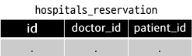

# 1. 개요

## M:N 관계 맛보기
- 병원 진료 시스템 모델 관계 만들기 (환자 - 의사)

## 1-1 N:1의 한계

### 1. 한 명의 의사에게 여러 환자가 예약할 수 있다고 모델 관계를 설정

```python
# hospitals/models.py
from django.db import models

class Doctor(models.Model):
    name = models.TextField()

    def __str__(self):
        return f'{self.pk}번 의사 {self.name}'


class Patient(models.Model):
    doctor = models.ForeignKey(Doctor, on_delete=models.CASCADE)
    name = models.TextField()

    def __str__(self):
        return f'{self.pk}번 환자 {self.name}'
```
### 2. 각각 2명의 의사와 환자를 생성하고 환자는 서로 다른 의사에게 예약했다고 가정한다.


### 3. 1번 환자(carol)가 두 의사 모두에게 방문하려고 한다.
```python
patient3 = Patient.objects.create(name='carol', doctor=doctor2)
```


### 4. 동시에 예약할 수가 없을까?


### 5.
- 동일한 환자지만 다른 의사에게 예약하기 위해서는 객체를 하나 더 만들어서 예약을 진행해야 한다.
- 새로운 환자 객체를 생성할 수 밖에 없음
- 외래 키 컬럼에 '1, 2' 형태로 참조하는 것은 Integer 타입이 아니기 때문에 불가능

-> `그렇다면 "예약 테이블을 따로 만들자"`

## 1-2 중개 모델

### 1. 환자 모델의 외래 키를 삭제하고 별도의 예약 모델을 새로 작성
- 예약 모델은 의사와 환자에 각각 N:1 관계를 가진다.

```python
from django.db import models


class Doctor(models.Model):
    name = models.TextField()

    def __str__(self):
        return f'{self.pk}번 의사 {self.name}'


# 외래키 삭제
class Patient(models.Model):
    name = models.TextField()

    def __str__(self):
        return f'{self.pk}번 환자 {self.name}'

# 중개모델 작성
class Reservation(models.Model):
    doctor = models.ForeignKey(Doctor, on_delete=models.CASCADE)
    patient = models.ForeignKey(Patient, on_delete=models.CASCADE)

    def __str__(self):
        return f'{self.doctor_id}번 의사의 {self.patient_id}번 환자'
```



### 2. 데이터 베이스 초기화 후 Migration 진행 및 shell_plus 실행
- 의사와 환자 생성 후 예약 만들기
```python
doctor1 = Doctor.objects.create(name='alice')
patient1 = Patient.objects.create(name='carol')
```


### 3. 예약 정보 조회


### 4. 1번 의사에게 새로운 환자 예약이 생성 된다면
```python
patient2 = Patient.objects.create(name='dane')
Reservation.objects.create(doctor=doctor1, patient=patient2)
```


### 5. 1번 의사의 예약 정보 조회


## 1-3 Django ManyToManyField

### 1. 환자 모델에 Django ManyToManyField 작성
```python
# hospitals/models.py

class Patient(models.Model):
    # ManyToManyField 작성
    doctors = models.ManyToManyField(Doctor)
    name = models.TextField()

    def __str__(self):
        return f'{self.pk}번 환자 {self.name}'

# Reservation Class 주석 처리
```

### 2. 데이터 베이스 초기화 후 Migration 진행 및 shell_plus 실행
- 생성된 중개 테이블 hospitals_patient_doctors 확인


### 3. 의사 1명과 환자 2명 생성
```python
doctor1 = Doctor.objects.create(name='alice')
patient1 = Patient.objects.create(name='carol')
patient2 = Patient.objects.create(name='dane')
```

### 4. 예약 생성 (환자가 의사에게 예약)


### 5. 예약 생성 (의사가 환자를 예약)


### 6. 예약 현황 중개 테이블 확인


### 7. 예약 취소하기 (삭제)
- 기존에는 해당하는 Reservation을 찾아서 지워야 했다면, 이제는 remove() 사용


## 1-4 'through' argument
- 그렇다면 중개 모델을 직접 작성하는 경우는 없을까?
- 중개 테이블을 수동으로 지정하려는 경우 through 옵션을 사용하여
- 사용하려는 중개 테이블을 나타내는 Django 모델을 지정할 수 있다.
- 가장 일반적인 용도는 `"중개테이블에 '추가 데이터'를 사용해 다대다 관계와 연결하려는 경우"`

### 1. through 설정 및 Reservation Class 수정
- 이제는 예약 정보에 "증상"과 "예약일"이라는 추가 데이터가 생긴다.


### 2. 데이터베이스 초기화 후 Migration 진행 및 shell_plus 실행
- 의사 1명과 환자 2명 생성
```python
doctor1 = Doctor.objects.create(name='alice')
patient1 = Patient.objects.create(name='carol')
patient2 = Patient.objects.create(name='dane')
```

### 3. 예약 생성 방법 1


### 4. 예약 생성 방법 2


### 5. 예약 삭제
```python
doctor1.patient_set.remove(patient1)
patient2.doctors.remove(doctor1)
```

## 1-5 정리
- `M:N` 관계로 맺어진 `두 테이블`에는 `변화가 없다.`
- `ManyToManyField`는 `중개 테이블을 자동으로 생성`한다.
- `ManyToManyField`는 `M:N 관계`를 맺는 `두 모델 어디에 위치해도 상관이 없다.`
- 대신 필드 작성 위치에 따라 참조와 역참조 방향을 주의해야 한다.
- `N:1`은 `완전한 종속의 관계`였지만 `M:N`은 `의사에게 진찰받는 환자`, `환자를 진찰하는 의사`의 두 가지 형태로 `모두 표현이 가능`하다.

# 2. ManyToManyField

## ManyToManyField(to, **options)
- many-to-many 관계 설정 시 사용하는 모델 필드
- 모델 필드의 RelatedManager를 사용하여 관련 개체를 추가, 제거 또는 생성
  - add(), remove(), create(), clear() ...

## 2-1 ManyToManyField's Arguments
1. related_name
2. through
3. symmetrical

## 2-2-1 related_name
- 역참조시 사용하는 manager name을 변경
```python
class Patient(models.Model):
    # ManyToManyField - related_name 작성
    doctors = models.ManyToManyField(Doctor, related_name='patients')
    name = models.TextField()
```
```python
# 변경 전
doctor.patient_set.all()

# 변경 후 
doctor.patients.all()
```

## 2-2-2 through
- 중개 테이블을 직접 작성하는 경우, through 옵션을 사용하여 중개 테이블을 나타내는 Django 모델을 지정
- 일반적으로 중개 테이블에 추가 데이터를 사용하는 다대다 관계와 연결하려는 경우
- (extra data with a mnay-to-many relationship)에 사용된다.

## 2-2-3 symmetrical
- ManyToManyField가 동일한 모델을 가리키는 정의에서만 사용
- 기본 값 : True
```python
# 예시
# 대칭 기능 symmetrical=True 블로그 서로 이웃처럼 한쪽이 신청을 보내면 1->2 수락후 자동으로 2-> 1도 이웃이되는 것

class Person(models.Model):
  friends = models.ManyToManyField('self') 
  # friends = models.ManyToManyField('self', symmetrical=False)
```
- True일 경우
  - _set 매니저를 추가하지 않음
  - source 모델의 인스턴스가 target 모델의 인스턴스를 참조하면 자동으로 target모델 인스턴스도 source 모델인 인스턴스를 자동으로 참조하도록 함(대칭)
  - 즉, 내가 당신의 친구라면 당신도 내 친구가 된다.
- 대칭을 원하지 않는 경우 False로 설정
  - Follow 기능 구현에서 사용한다.

## 2-2-4 M:N에서의 methods
- add()
  - "지정된 객체를 관련 객체 집합에 추가"
  - 이미 존재하는 관계에 사용하면 관계가 복제되지 않음

- remove()
  - "관련 객체 집합에서 지정된 모델 개체를 제거"

# 3. Article & User

## 3-1 Many to many relationships (N:M or M:N)
- 한 테이블의 0개 이상의 레코드가 다른 테이블의 0개 이상의 레코드와 관련된 경우
- `양쪽 모두에서 N:1 관계를 가진다.`

## 3-2 Article(M) - User(N)
- 0개 이상의 게시글은 0명 이상의 회원과 관련된다.
- `게시글은 회원으로부터 0개 이상의 좋아요를 받을 수 있고, 회원은 0개 이상의 게시글에 좋아요를 누를 수 있다.`

## 3-3 모델 관계 설정

### 3-3-1 ManyToManyField 작성


### 3-3-2 Migration 진행 후 에러 확인


### 3-3-3 모델 관계 설정
- like_users 필드 생성 시 자동으로 역참조에는 article_set 매니저가 생성됨
- 그러나 이전 N:1(Article-User) 관계에서 이미 해당 매니저를 사용 중
  - user.article_set.all() -> 해당 유저가 작성한 모든 게시글 조회
- user가 작성한 글들(user.article_set)과 user가 좋아요를 누른 글(user.article-set)을 구분할 수 없게 됨
- user와 관계된 ForeignKey 혹은 ManyToManyField 중 하나에 related_name을 작성해야 함

## :star: user.article_set
- N:1 - "유저가 작성한 게시글"
- M:N - "유저가 좋아요 한 게시글"
- `related manager 이름이 충돌`

## 3-3-4 related_name 작성 후 Migration


## 3-3-5 생성된 중개 테이블 확인


## 3-4 User - Article 간 사용 가능한 related manager 정리
- article.user
  - 게시글을 작성한 유저 - N:1
- user.article_set
  - 유저가 작성한 게시글(역참조) - N:1
- article.like_users
  - 게시글을 좋아요한 유저 - M:N
- user.like_articles
  - 유저가 좋아요한 게시글(역참조) - M:N

## 3-5 좋아요 구현

### 3-5-1 url 및 view 함수 작성
```python
# articles/urls.py
from django.urls import path
from . import views

app_name = 'articles'
urlpatterns = [
  ...
  path('<int:article_pk>/likes/', views.likes, name="likes"),
]
```

```python
# articles/views.py

def likes(request, article_pk):
  # 좋아요를 누르는 대상 게시글
  article = Article.objects.get(pk=article_pk)

  # 좋아요 관계를 추가 or 삭제
  # case 1. 현재 좋아요를 요청하는 유저가 해당 게시글의 좋아요를 누른 유저 목록에 있는지 없는지를 확인
  if request.user in article.like_users.all():
  
  # case 2. 해당 게시글의 좋아요를 누른 유저에서 현재 요청하는 유저의 존재를 조회
  # if article.like_users.filter(pk=request.user.pk).exists(): # 좋아요를 누른 목록이 엄청 커지면 in 연산자가 검색을 하는데 느려질 때 이걸 사용 (존재 여부 확인하는 것에서는 exists가 좀 더 권장)

      # 좋아요 취소
      article.like_users.remove(request.user) # 참조
      # # 좋아요 취소 유저 기준으로 역 참조
      # request.user.like_articles.remove(article)
  else:
      # 좋아요 추가
      article.like_users.add(request.user) # 참조
      # # 좋아요 취소 유저 기준으로 역 참조
      # request.user.like_articles.add(article) # 역참조
  return redirect('articles:index')


  # 좋아요 관계를 추가 or 삭제
  # 한 번 누르면 추가, 두 번 누르면 삭제 -> 그럼 세 번째부터는...?
  # 체크박스? 좋아요를 누를 때 체크박스를 사용하지 않는다...
  # 게스글에 좋아요를 누른 모든 유저를 조회할 수 있다. 위에 article = Article.objects.get(pk=article_pk)가 있기 때문에

  # article.like_users.all()
  # 지금 좋아요를 요청하는 유저가 저 유저 목록에 있는지 없는지
  
  # 목록에 있으면? => 좋아요 취소
  # 해당 목록에 없으면? => 좋아요 추가
```

### 3-5-2 index 템플릿에서 각 게시글에 좋아요 버튼 출력
```html
<!-- articles/index.html -->

  <p>작성자: {{ article.user }}</p>
  <p>제목: 
    <a href="">{{ article.title }}</a>
  </p>
  <p>내용: {{ article.content }}</p>

  <form action="" method="POST">
    
    
      <input type="submit" value="좋아요 취소">
    
      <input type="submit" value="좋아요">
    
  </form>
  <hr>

```

### 3-5-3 좋아요 버튼 출력 확인


### 3-5-4 좋아요 버튼 클릭 후 테이블 확인


# 참고

## .exists()
- QuerySet에 결과가 포함되어 있으면 True를 반환하고 그렇지 않으면 False를 반환 특히 큰 QuerySet에 있는 특정 개체의 존재와 관련된 검색에 유용

## exists() 적용

