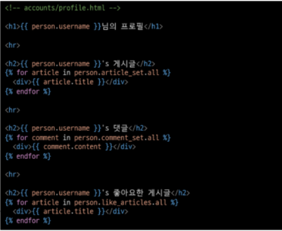

# 1. 개요

## 1-1 Profile 구현

## 1-1-1 자연스러운 follow 흐름을 위한 프로필 페이지 작성
```python
# accounts/urls.py
from django.urls import path
from . import views


app_name = 'accounts'
urlpatterns = [
  ...
  path('profile/<username>/', views.profile, name='profile'), # <str:uername>인데 str생략가능
]
```
```python
# accounts/views.py
from django.contrib.auth import get_user_model

def profile(request, username):
  # User를 직접참조가 아닌 간접 참조를 한다.
  User = get_user_model()
  person = User.objects.get(username=username) # request와 user는 어느 템플릿에서 바로 사용가능하다 장고가 이미 로드해두어서 그래서 User로 그대로 사용한 게 아니라 person으로 다른 이름으로 사용
  context = {
      'person':person,
  }
  return render(request, 'accounts/profile.html', context)
```

## 1-1-2 profile 템플릿 작성



## 1-1-3 profile 템플릿으로 이동할 수 있는 하이퍼링크 작성


## 1-1-4 출력 확인


# 2. User & User (Follow 구현)

## User(M) - User(N)
- 유저는 0명 이상의 다른 유저와 관련된다.
- `유저는 다른 유저로부터 0개 이상의 팔로우를 받을 수 있고, 유저는 0명 이상의 다른 유저들에게 팔로잉 할 수 있다.`

## 2-1 Follow 구현

### 2-1-1 ManyToManyField 작성 및 Migration 진행
```python
# accounts/models.py

class User(AbstractUser):
  followings = models.ManyToManyField('self', symmetrical=False, related_name='followers')
```

### 2-1-2 중개테이블 필드 확인


### 2-1-3 url 및 view 함수 작성
```python
# accounts/urls.py

urlpatterns = [
  ...,
  path('<int:user_pk>/follow/', views.follow, name='follow'),
]
```
```python
@login_required
def follow(request, user_pk): # request.user가 우리가 된다 우리가 요청을 하기 때문에 you == person
  # 팔로우를 할 대상이 필요
  User = get_user_model()
  you = User.objects.get(pk=user_pk)
  me = request.user

  if me != you:
  # 팔로우 or 언팔로우
      if you.followers.filter(pk=me.pk).exists():
      # if me in you.followers.all():
      # if request.user in person.followers.all():
          # 언팔로우
          you.followers.remove(me)

          # me를 기준으로 하면
          # me.followings.remove(you) # 내가 팔로우하고 있는 사람 중에 너를 빼는 것
      else:
          #팔로우
          you.followers.add(me)

          #me를 기준으로
          # me.following.add(you) # 내가 팔로우 하고 있는 사람에 너를 추가
  return redirect('accounts:profile', you.username) # 내 프로필 페이지가 아니라 상대방의 프로필 페이지이기 때문에 you.username

>>>> 다시 표현하면
def follow(request, user_pk):
  User = get_user_model()
  person = User.objects.get(pk = user_pk)
  if person != request,user:
    if person.followers.filter(pk=request.user.pk).exists():
    # if request.user in person.followers.all():
      person.followers.remove(request.user)
    else:
      person.followers.add(request.user)
  return redirect('accounts:profile', person.username)
```
### 2-1-4 프로필 유저의 팔로잉, 팔로우 수 & 팔로우, 언팔로우 버튼 작성


### 2-1-5 팔로우 버튼 클릭 후 팔로우 버튼 변화 및 중개 테이블 데이터 확인

