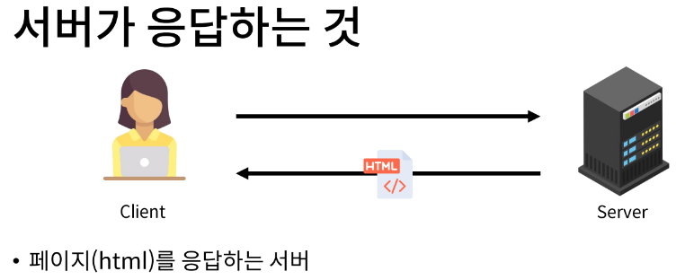
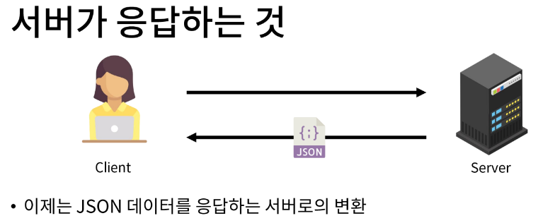
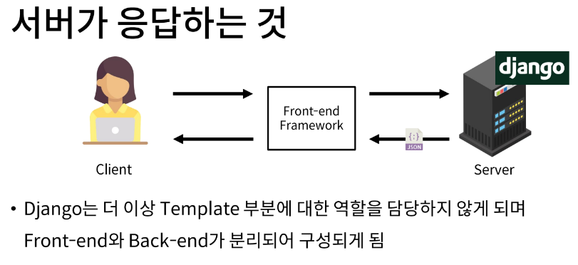
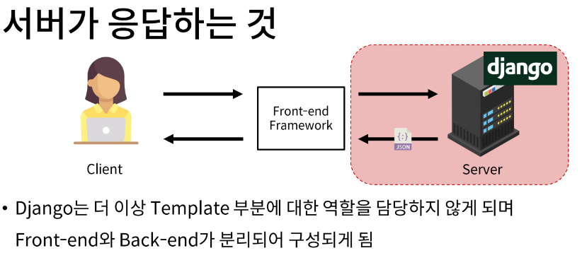

# 1. 개요

## 1-1 HTTP Request Methods
- 리소스(resource, 자원)에 대한 행위(수행하고자 하는 동작)를 정의 HTTP verbs 라고도 한다.

## 1-2 대표 HTTP Request Methods
### 1. GET
  - 서버에 리소스의 표현을 요청
  - GET을 사용하는 요청은 데이터만 검색해야 한다.

### 2. POST
  - 데이터를 지정된 리소스에 제출
  - 서버의 상태를 변경

### 3. PUT
  - 요청한 주소의 리소스를 수정

### 4. DELETE
  - 지정된 리소스를 삭제

## 1-3 HTTP response status codes
- 특정 HTTP 요청이 성공적으로 완료되었는 지 여부를 나타냄
- 응답은 5개의 그룹으로 나뉨
  1. Informational responses (100-199)
  2. Successful responses (200-299)
  3. Redirection messages (300-399)
  4. Client error responses (400-499)
  5. Server error responses (500-599)

# 2. REST API

## 2-1 API (Application Programming Interface)
- 애플리케이션과 프로그래밍으로 소통하는 방법

## 2-2 API
### API는 복잡한 코드를 추상화하여 대신 사용할 수 있는 몇 가지 더 쉬운 구문을 제공
  - 예를 들어 집의 가전 제품에 전기를 공급해야 한다고 가정해보자
  - 우리는 그저 가전 제품의 플러그를 소켓에 꽂으면 제품이 작동한다
  - 중요한 것은 우리가 가전 제품에 전기를 공급하기 위해 `직접 배선을 하지 않는다는 것`
  - 이는 매우 위험하면서도 비효율적인 일

## 2-3 Web API
- 웹 서버 또는 웹 브라우저를 위한 API
- 현재 웹 개발은 모든 것을 하나부터 열까지 직접 개발하기보다 여러 Open API를 활용하는 추세
- 대표적인 Third Party Open API 서비스 목록
  - Youtube API
  - Naver Papago API
  - Kakao Map API
- API은 다양한 타입의 데이터를 응답
  - HTML, JSON 등

## 2-4 REST (Representational State Transfer)
- API Server를 개발하기 위한 일종의 소프트웨어 설계 방법론
  - 2000년 로이 필딩의 박사학위 논문에서 처음으로 소개된 후 네트워킹 문화에 널리 퍼짐
- '소프트웨어 아키텍쳐 디자인 제약 모음' (a group of software architecture design constraints)
- REST 원리를 따르는 시스템을 `RESTful`하다고 부름
- `"자원을 정의"`하고 `"자원에 대한 주소를 지정"`하는 전반적인 방법을 시술

## 2-5 REST에서 자원을 정의하고 주소를 지정하는 방법
1. 자원의 식별
  - URL
2. 자원의 행위
  - HTTP Methods
3. 자원의 표현
  - 궁극적으로 표현되는 결과물
  - JSON으로 표현된 데이터를 제공

## 2-6 REST API
- REST라는 API 디자인 아키텍처를 지켜 구현한 API

# 3. Response JSON
## 3-1 서버가 응답하는 것
- 지금까지 Django로 작성한 서버는 사용자에게 페이지(html)만 응답하고 있었음
- 하지만 사실 서버가 응답할 수 있는 것은 페이지 뿐만 아니라 다양한 데이터 타입을 응답할 수 있음

## 3-2 Django REST framework (DRF)
- Django에서 Restful API 서버를 쉽게 구축할 수 있도록 도와주는 오픈 소스 라이브러리
