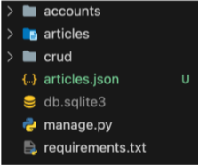
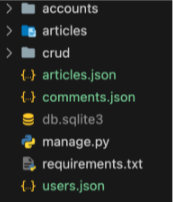

# 1. 개요

## fixtures
- Django가 데이터베이스로 가져오는 방법을 알고 있는 데이터 모음
  - Django가 직접 만들기 때문에 데이터베이스 구조에 마주어 작성되어 있음

## django는 fixtures를 사용해 모델에 초기 데이터를 제공

## 1-1 초기 데이터의 필요성

### 1. 협업하는 A, B 유저가 있다고 생각해보자
  1. A가 먼저 프로젝트를 작업 후 github에 push 한다.
    - gitignore 설정으로 인해 DB는 업로드하지 않기 때문에 A가 작성한 데이터는 올라가지 않는다.
  2. B가 github에서 A push한 프로젝트를 pull (혹은 clone) 한다.
    - 마찬가지로 프로젝트는 받았지만 A가 생성하고 조작한 DB가 없는 프로젝트를 받게 된다.

### 2. 이처럼 Django 프로젝트의 앱을 처음 설정할 때 동일하게 준비된 데이터로 데이터베이스를 미리 채우는 것이 필요한 순간이 있다.

### 3. Django에서는 fixtures를 사용해 앱에 초기 데이터(initial data)를 제공할 수 있다.

# 2. 초기 데이터 제공하기

## 2-1 사전준비
- M:N 까지 모두 작성된 Django 프로젝트에서 유저, 게시글, 댓글, 좋아요 등 각 데이터를 최소 2개 이상 생성해두기

## 2-2 fixtures 명령어
- `dumpdata` : 생성 (데이터 추출)
- `loaddata` : 로드 (데이터 입력)

## 2-3 dumpdata
- 데이터베이스의 모든 데이터를 출력
- 여러 모델을 하나의 json 파일로 만들 수 있음
```python
# 작성 예시
$ python manage.py dumpdata [app_name[.ModelName] [app_name[.ModelName] ...]] > filename.json
```

## 2-4-1 fixtures 생성
```python
$ python mange.py dumpdata --indent 4 articles.article > articles.json
```



## 2-4-2 fixtures 생성
```python
$ python manage.py dumpdata --indent 4 accounts.user > users.json
$ python manage.py dumpdata --indent 4 articles.comment > comments.json
```



## 2-5 loaddata
- fixtures 데이터를 데이터베이스를 불러오기

## 2-6 fixtures 기본 경로
- `app_name/fixtrues/
- Django는 설치된 모든 app의 디렉토리에서 fixtures 폴더 이후의 경로로 fixtures 파일을 찾아 load 함

## 2-7-1 fixtures 불러오기
```python
# 해당 위치로 fixture 파일 이동

articles/
  fixtures/
    articles.json
    users.json
    comments.json
```
- db.sqlite3 파일 삭제 후 migrate 진행

## 2-7-2 fixtures 불러오기
```python
$ python manage.py loaddata articles.json user.json comments.json
```
- load 후 데이터가 잘 입력되었는지 확인하기

## 2-7-3 loaddata 순서 주의사항
- loaddata를 한 번에 실행하지 않고 하나씩 실행한다면 모델 관계에 따라 순서가 중요할 수 있음
  - comment는 article에 대한 key 및 user에 대한 key가 필요
  - article은 user에 대한 key가 필요
- 즉, 현재 모델 관계에서는 user-> article -> comment 순으로 data를 넣어야 오류가 발생하지 않음
```python
$ python manage.py loaddata users.json
$ python manage.py loaddata articles.json
$ python manage.py loaddata comments.json
```

# 참고

## 모든 모델을 한 번에 dump 하기
```python
# 3개의 모델을 하나의 json 파일로
$ python manage.py dumpdata --indent 4 articles.articles.coment accounts.user > data.json

# 모든 모델을 하나의 json 파일로
$ python manage.py dumpdata --indent 4 > data.json
```

## loaddata 시 encoding codec 관련 에러가 발생하는 경우
- 2가지 방법 중 택 1

1. dumpdata 시 추가 옵션 작성
```python
$ python -Xutf8 manage.py dumpdata [생략]
```

2. 메모장 활용
  1. 메모장으로 json 파일 열기
  2. "다른 이름으로 저장" 클릭
  3. 인코딩을 UTF8로 선택 후 저장
